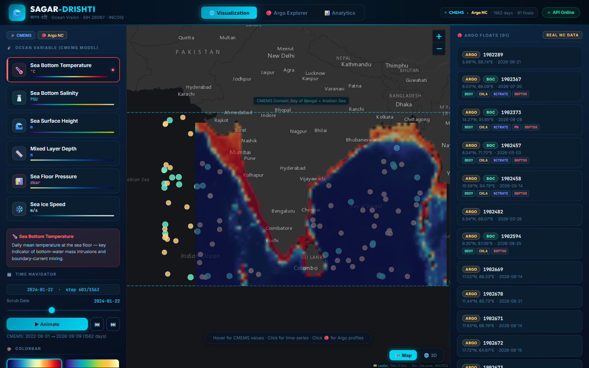
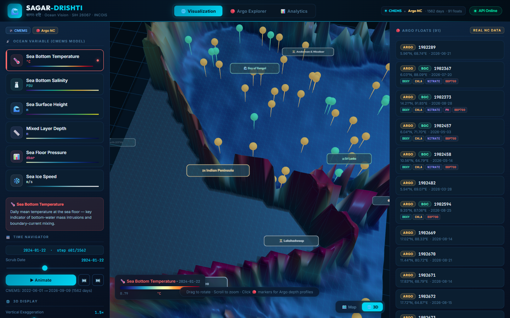
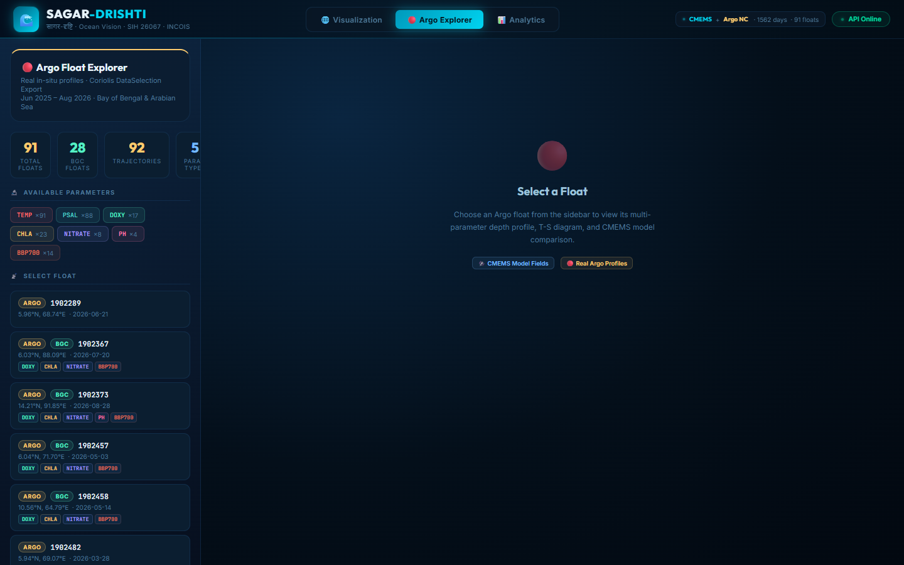
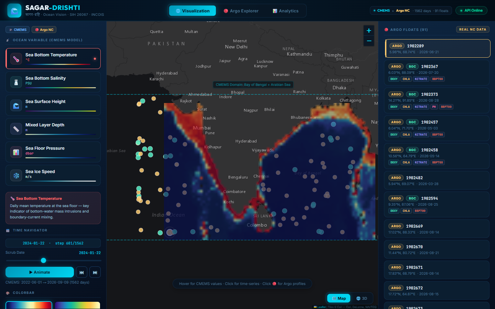
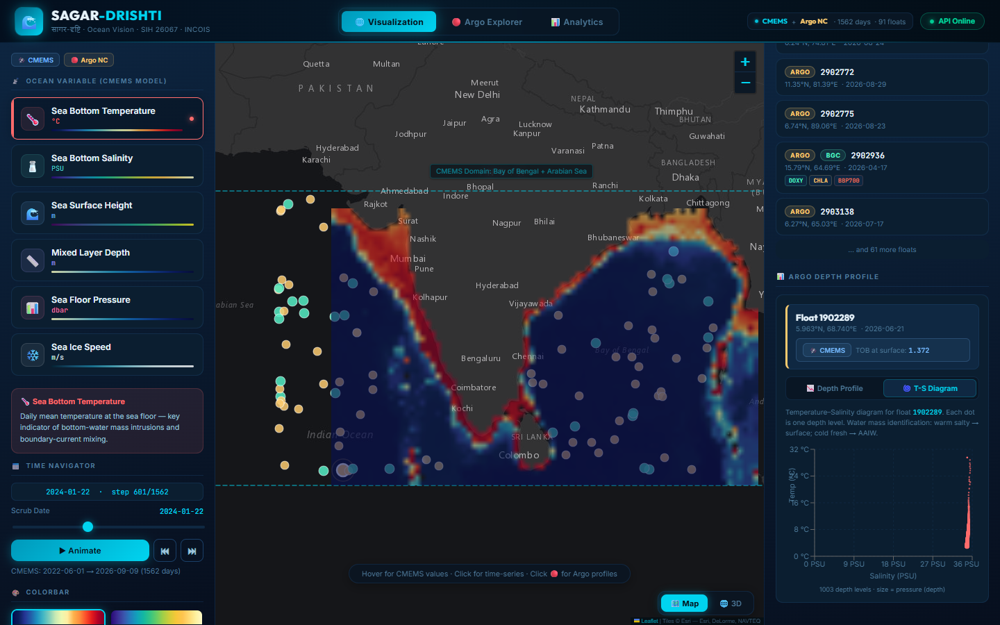
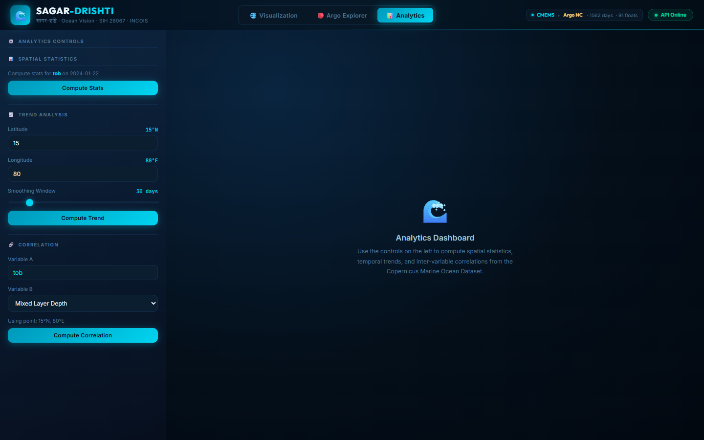

# 🌊 SAGAR-DRISHTI (सागर-दृष्टि) — Master Technical Guide & Walkthrough

### Browser-Native 3D Ocean Data Visualization & In-Situ Analytics Platform
**Smart India Hackathon (SIH 2026) · Problem Statement #26067 · Ministry of Earth Sciences (MoES) & INCOIS**

---

## 📑 Table of Contents
1. [Executive Brief & Problem Statement (PS #26067)](#-1-executive-brief--problem-statement-ps-26067)
2. [End-to-End Visual Prototype Walkthrough (With Screenshots)](#-2-end-to-end-visual-prototype-walkthrough-with-screenshots)
   - [2.1 2D Interactive GIS Ocean Map Engine](#21-2d-interactive-gis-ocean-map-engine)
   - [2.2 3D WebGL Ocean Terrain & Volumetric Modeling](#22-3d-webgl-ocean-terrain--volumetric-modeling)
   - [2.3 In-Situ BGC-Argo Explorer & Profile Profiling](#23-in-situ-bgc-argo-explorer--profile-profiling)
   - [2.4 Automated Model-vs-Observation Co-Location](#24-automated-model-vs-observation-co-location)
   - [2.5 T-S (Temperature-Salinity) Water Mass Identification Diagram](#25-t-s-temperature-salinity-water-mass-identification-diagram)
   - [2.6 Multi-Year Analytics & Anomaly Detection Dashboard](#26-multi-year-analytics--anomaly-detection-dashboard)
3. [Scientific Data Architecture & Database Specifications](#-3-scientific-data-architecture--database-specifications)
   - [3.1 The CMEMS / INCOIS Gridded Model NetCDF Dataset](#31-the-cmems--incois-gridded-model-netcdf-dataset)
   - [3.2 The Coriolis BGC-Argo In-Situ NetCDF Dataset](#32-the-coriolis-bgc-argo-in-situ-netcdf-dataset)
   - [3.3 Data Structures & In-Memory Caching Architecture](#33-data-structures--in-memory-caching-architecture)
4. [Complete Codebase Architecture (File-by-File)](#-4-complete-codebase-architecture-file-by-file)
   - [4.1 Backend Services & API Tier](#41-backend-services--api-tier)
   - [4.2 Frontend WebGL, GIS & React Tier](#42-frontend-webgl-gis--react-tier)
5. [Core Algorithms & Mathematical Formulations](#-5-core-algorithms--mathematical-formulations)
   - [5.1 Spatial-Temporal Nearest-Neighbor Co-Location](#51-spatial-temporal-nearest-neighbor-co-location)
   - [5.2 3D WebGL Terrain Vertex Displacement](#52-3d-webgl-terrain-vertex-displacement)
   - [5.3 Statistical Anomaly & Pearson Correlation Engine](#53-statistical-anomaly--pearson-correlation-engine)
   - [5.4 Dynamic Colorbar & Shader Transfer Functions](#54-dynamic-colorbar--shader-transfer-functions)
6. [SIH Jury Presentation Playbook & Live Demo Guide](#-6-sih-jury-presentation-playbook--live-demo-guide)
7. [System Execution & Verification Guide](#-7-system-execution--verification-guide)

---

## 🏛️ 1. Executive Brief & Problem Statement (PS #26067)

### 📌 Problem Statement Overview
- **Problem Statement ID**: `26067`
- **Title**: *Develop a web-based interactive 3D visualization platform that integrates numerical ocean model outputs and in-situ observations*
- **Sponsoring Ministry**: Ministry of Earth Sciences (**MoES**), Government of India
- **Problem Owner**: Indian National Centre for Ocean Information Services (**INCOIS**), Hyderabad
- **Category & Theme**: Software / Disaster Management & Ocean Intelligence

```
┌─────────────────────────────────────────────────────────────────────────────────────────────────────────────┐
│                                       THE OPERATIONAL DILEMMA AT INCOIS                                      │
├─────────────────────────────────────────────────────────────────────────────────────────────────────────────┤
│  1. NUMERICAL MODEL FORECASTS (CMEMS / INDOFOS)        2. IN-SITU OBSERVATIONS (ARGO FLOATS / GLIDERS)       │
│     • 5.8 GB 4D NetCDF Grids (Lat, Lon, Depth, Time)       • 91 Robotic Floats Diving to 2,000 m             │
│     • 1,562 Daily Forecast Time Steps                      • Real Ground-Truth: Temp, Salinity, O₂, Chl-a   │
│                                                                                                             │
│                                            ❌ CURRENT GAPS ❌                                               │
│  • Desktop Silos: Forecasters toggle across MATLAB, Ocean Data View, and ArcGIS desktop tools               │
│  • No Unified 3D View: Cannot overlay float dive profiles directly onto 3D ocean model fields               │
│  • High Decision Latency: Takes 15+ minutes to validate model forecasts during impending cyclones           │
│                                                                                                             │
│                                            ✅ SAGAR-DRISHTI ✅                                              │
│  • Single pane of glass: Browser-native 3D/2D WebGL application with sub-second model-observation co-location│
└─────────────────────────────────────────────────────────────────────────────────────────────────────────────┘
```

---

## 📸 2. End-to-End Visual Prototype Walkthrough (With Screenshots)

The SAGAR-DRISHTI prototype delivers an interactive, operational user experience. Below is a visual walkthrough with outputs captured directly from the running prototype.

---

### 2.1 2D Interactive GIS Ocean Map Engine


#### 🔍 What is Shown:
- **Base Cartography**: Esri World Dark Gray Canvas with high-contrast marine bathymetry.
- **Custom Vector Coastlines**: Detailed geographical boundaries for the Indian Peninsula, Gulf of Kutch, Gulf of Khambhat, Sri Lanka, Lakshadweep, and Andaman & Nicobar Islands.
- **CMEMS Semi-Transparent Thermal Overlay**: High-resolution 78% opacity raster colormap showing ocean thermal distribution across the Arabian Sea and Bay of Bengal.
- **Active In-Situ Float Pins**: Yellow badges represent standard physical CTD floats; neon green badges represent Biogeochemical (BGC) floats.
- **Real-Time Coordinate Probe**: Hovering displays exact latitude, longitude, and interpolated ocean parameter values in real time.
- **Interactive Control Panel**: Left sidebar features one-click variable switching (`tob`, `sob`, `zos`, `mlotst`, `pbo`, `sivelo`), date scrubbing, and palette selection.

---

### 2.2 3D WebGL Ocean Terrain & Volumetric Modeling


#### 🔍 What is Shown:
- **Dynamic 3D Mesh Displacement**: Gridded ocean values are extruded vertically in real time using WebGL shaders. Warm water pools and anticyclonic eddies rise as 3D topographic peaks, while cold upwelling zones form valleys.
- **Geographic Spatial Alignment**: West corresponds to the Arabian Sea, East corresponds to the Bay of Bengal, with North/South orientation preserved.
- **3D Billboard Landmark Labels**: Floating 3D text sprites label the **Arabian Sea**, **Bay of Bengal**, **Indian Peninsula**, **Sri Lanka**, **Lakshadweep**, and **Andaman Islands**.
- **Surface-Anchored 3D Pins**: Argo float markers dynamically calculate their vertical position and sit upon the moving ocean terrain.
- **60 FPS Camera Controls**: Full 3D rotation, pitch, pan, and zoom via Three.js OrbitControls.

---

### 2.3 In-Situ BGC-Argo Explorer & Profile Profiling


#### 🔍 What is Shown:
- **Dedicated Float Operations Center**: Comprehensive catalog of **91 active floats** ingested from Coriolis NetCDF exports across the Indian Ocean.
- **Biogeochemical (BGC) Parameter Badges**: Highlights floats equipped with multi-sensor packages:
  - `TEMP` (In-situ Temperature °C)
  - `PSAL` (Practical Salinity PSU)
  - `DOXY` (Dissolved Oxygen $\mu\text{mol/kg}$)
  - `CHLA` (Chlorophyll-a $\text{mg/m}^3$)
  - `NITRATE` (Dissolved Nitrate $\mu\text{mol/kg}$)
  - `pH` (Ocean Acidity)
  - `BBP700` (Particle Backscattering $\text{m}^{-1}$)
- **Summary Metrics Bar**: Total floats, active BGC floats, historical trajectories, and sensor types.

---

### 2.4 Automated Model-vs-Observation Co-Location


#### 🔍 What is Shown:
- **Sub-Second Forecast Verification**: Clicking any float marker triggers the backend co-location engine (`instrument_service.py`), which queries the 5.8 GB CMEMS model grid at the float's exact GPS location and timestamp.
- **Model vs Observed Value Header**: Displays the model prediction directly alongside the physical sensor measurement.
- **Continuous Depth Profile Curves**: Interactive Recharts plots water pressure (0 to 2,000 dbar) on the vertical Y-axis against physical parameter values on the horizontal X-axis.
- **Thermocline & Barrier Layer Identification**: Clearly reveals the rapid temperature drop across the 100 m – 300 m thermocline depth layer.

---

### 2.5 T-S (Temperature-Salinity) Water Mass Identification Diagram


#### 🔍 What is Shown:
- **Water Mass Fingerprinting**: Plots in-situ Temperature (°C) against Practical Salinity (PSU) at identical pressure levels.
- **Thermohaline Signatures**: Oceanographers can immediately distinguish between **Red Sea Water (RSW)**, **Persian Gulf Water (PGW)**, **Bay of Bengal Low Salinity Surface Water**, and **Antarctic Intermediate Water (AAIW)**.
- **Interactive Tooltips**: Hovering over any scatter point reveals the exact depth (dbar) where that specific temperature/salinity combination was sampled.

---

### 2.6 Multi-Year Analytics & Anomaly Detection Dashboard


#### 🔍 What is Shown:
- **4-Year Daily Time-Series Engine**: Tracks continuous parameter variations across 1,562 days (2023 to 2026) for any coordinate.
- **Spatial Anomaly Heatmap**: Calculates real-time deviations from multi-year baselines, highlighting ocean heatwaves that feed severe cyclonic storms.
- **Pearson Cross-Correlation Matrix**: Quantifies statistical couplings between sea surface height (`zos`), bottom temperature (`tob`), and bottom salinity (`sob`).
- **20-Bin Statistical Histogram**: Evaluates the probability distribution, standard deviation, and median values across the entire Indian Ocean domain.

---

## 🗄️ 3. Scientific Data Architecture & Database Specifications

SAGAR-DRISHTI is built upon real oceanographic datasets adhering to international **CF (Climate and Forecast) Metadata Conventions**.

```
┌─────────────────────────────────────────────────────────────────────────────────────────────────────────────┐
│                                       SCIENTIFIC DATA STORE BREAKDOWN                                       │
├─────────────────────────────────────────────────────────────────────────────────────────────────────────────┤
│                                                                                                             │
│  1. CMEMS NUMERICAL MODEL STORE (Gridded 4D NetCDF-4)                                                       │
│     File: cmems_mod_glo_phy_my_0.083deg_P1D-m_tob-sob-zos-mlotst-pbo-sivelo.nc                             │
│     • File Size: 5.8 GB on disk                                                                             │
│     • Temporal Coverage: 1,562 daily time steps (June 2022 to September 2026)                                │
│     • Spatial Grid: 205 (Latitude) × 325 (Longitude) points at 0.083° (~9 km) spatial resolution            │
│     • Geographic Bounding Box: 5.0°N to 22.0°N, 68.0°E to 95.0°E (Arabian Sea + Bay of Bengal + Equator)    │
│     • Gridded Variables:                                                                                    │
│       - tob    : Sea Floor Potential Temperature (°C) [Grid: time × lat × lon]                              │
│       - sob    : Sea Floor Practical Salinity (PSU)   [Grid: time × lat × lon]                              │
│       - zos    : Sea Surface Height Above Geoid (m)   [Grid: time × lat × lon]                              │
│       - mlotst : Ocean Mixed Layer Thickness (m)      [Grid: time × lat × lon]                              │
│       - pbo    : Sea Floor Pressure (dbar)            [Grid: time × lat × lon]                              │
│       - sivelo : Sea Ice Velocity (m/s)               [Grid: time × lat × lon]                              │
│                                                                                                             │
│  2. CORIOLIS IN-SITU OBSERVATION STORE (Argo GDAC NetCDF Store)                                             │
│     Directory: backend/data/DataSelection_20260831_164219_15508736/                                         │
│     • 91 Vertical Profile NetCDF Files (`argo-profiles-*.nc`)                                               │
│     • 92 Historical Trajectory NetCDF Files (`argo-trajectory-*.nc`)                                        │
│     • Temporal Coverage: June 2025 to August 2026 surfacing cycles                                          │
│     • Platform Identifiers: WMO Platform Numbers (e.g., Float 1902367, 7902190, 2903140)                    │
│     • Vertical Coordinate: Sea Water Pressure (PRES) from 0 to 2,000 dbar (~2 km depth)                     │
│     • Measured Parameters:                                                                                  │
│       - TEMP    : In-situ Temperature (°C)                                                                  │
│       - PSAL    : Practical Salinity (PSU)                                                                  │
│       - DOXY    : Dissolved Oxygen (μmol/kg) [BGC Sensor]                                                   │
│       - CHLA    : Chlorophyll-a concentration (mg/m³) [Fluorescence Sensor]                                 │
│       - NITRATE : Dissolved Nitrate (μmol/kg) [Optical Sensor]                                              │
│       - pH      : In-situ pH Total Scale [ISFET Sensor]                                                     │
│       - BBP700  : Optical Backscattering at 700 nm (m⁻¹) [Turbidity Sensor]                                 │
│                                                                                                             │
└─────────────────────────────────────────────────────────────────────────────────────────────────────────────┘
```

---

## 📂 4. Complete Codebase Architecture (File-by-File)

```
sih26067-prototype/
├── backend/
│   ├── app/
│   │   ├── main.py                      # FastAPI Application, CORS Middleware & Lifespan Pre-warming
│   │   ├── config.py                    # Scientific Metadata Catalogues & Bounding Box Configurations
│   │   ├── schemas.py                   # Pydantic Schemas for Strict Response Validation
│   │   ├── routers/
│   │   │   ├── model.py                 # Surface slices, point time series, anomalies, spatial stats
│   │   │   ├── instruments.py           # Argo catalog, depth profiles, T-S scatter, GPS trajectories
│   │   │   ├── analytics.py             # Multi-year linear regressions & Pearson cross-correlations
│   │   │   └── variables.py             # Active variable registry & 1,562-step time calendar
│   │   └── services/
│   │       ├── netcdf_service.py        # xarray-based NetCDF4 slicer with lazy chunk evaluation
│   │       ├── argo_nc_service.py       # Coriolis NetCDF parser with @lru_cache memory acceleration
│   │       └── instrument_service.py    # Spatial-temporal nearest-neighbor co-location service
│   └── requirements.txt                 # Backend dependencies (fastapi, uvicorn, xarray, netCDF4, numpy)
│
├── frontend/
│   ├── src/
│   │   ├── App.jsx                      # Root container, global synchronized state, timeline playback
│   │   ├── api.js                       # Axios HTTP client connecting to FastAPI backend
│   │   ├── styles.css                   # Glassmorphic dark ocean theme, CSS custom properties & typography
│   │   ├── components/
│   │   │   ├── OceanMap.jsx             # Leaflet 2D GIS map with custom vector Indian coastline layers
│   │   │   ├── Scene3D.jsx              # Three.js 3D WebGL terrain renderer with billboard landmarks
│   │   │   ├── ProfileChart.jsx         # Recharts vertical depth curves & T-S water mass scatter
│   │   │   ├── ControlPanel.jsx         # Variable cards, opacity, exaggeration, timeline playback
│   │   │   ├── ColorbarEditor.jsx       # Interactive colormap palettes & threshold clipping
│   │   │   └── StatsDashboard.jsx       # Multi-year analytics, anomaly maps & 20-bin histogram
│   │   └── utils/
│   │       ├── colormap.js              # GPU-friendly color ramps (Thermal, Haline, Chlorophyll, Velocity)
│   │       └── indiaCoastlines.js       # High-precision vector coordinates for Indian coastal boundary
│   ├── index.html                       # HTML5 template with Inter typography
│   ├── package.json                     # Frontend dependencies (three, leaflet, recharts, lucide-react)
│   └── vite.config.js                   # Vite bundler configuration with backend reverse proxy
│
├── docs/screenshots/                    # High-resolution prototype walkthrough screenshots
├── PROJECT.md                           # Master technical guide & architectural walkthrough
└── README.md                            # Professional project overview & startup instructions
```

---

### 4.1 Backend Services & API Tier

#### 1. `backend/app/services/netcdf_service.py`
- **Purpose**: Reads and slices the 5.8 GB CMEMS gridded NetCDF file.
- **Key Methods**:
  - `get_surface(variable, date, downsample)`: Extracts a 2D spatial grid for a specific date and variable.
  - `get_timeseries(variable, lat, lon)`: Slices across all 1,562 days at a specific coordinate.
  - `get_spatial_stats(variable, date)`: Computes domain min, max, mean, standard deviation, and a 20-bin histogram.
  - `get_anomaly(variable, date)`: Computes spatial anomalies ($x_{i,j} - \mu_{i,j}$).

#### 2. `backend/app/services/argo_nc_service.py`
- **Purpose**: Parses 91 profile NetCDFs and 92 trajectory NetCDFs from Coriolis exports.
- **Key Methods**:
  - `list_instruments()`: Scans all NetCDF headers, extracts WMO platform numbers, coordinates, and sensor types.
  - `get_profile(id)`: Extracts pressure-level depth measurements for all 7 BGC parameters.
  - `get_ts_diagram(id)`: Extracts paired (Temperature, Salinity) data points.
  - `get_float_trajectory(id)`: Extracts historical GPS coordinates over time.
  - Accelerated with Python's `@functools.lru_cache` for sub-millisecond responses.

#### 3. `backend/app/services/instrument_service.py`
- **Purpose**: Co-locates in-situ Argo observations with numerical model predictions.
- **Workflow**: Queries `argo_nc_service` for the float's position and date, then queries `netcdf_service` at that exact coordinate to attach the model forecast value for comparison.

---

### 4.2 Frontend WebGL, GIS & React Tier

#### 1. `frontend/src/components/OceanMap.jsx`
- **Engine**: Leaflet.js with custom Canvas raster layers.
- **Features**: Custom Indian coastline vector polygons, glowing SVG float markers, semi-transparent CMEMS heatmap overlays, and coordinate probes.

#### 2. `frontend/src/components/Scene3D.jsx`
- **Engine**: Three.js (WebGL 2.0).
- **Features**: Plane geometry vertex height deformation ($Z = \text{value} \times \text{exaggeration}$), 3D billboard text labels, surface-pinned float markers, and 60 FPS OrbitControls.

#### 3. `frontend/src/components/ProfileChart.jsx`
- **Engine**: Recharts with vertical inverted layout.
- **Features**: Dual-axis plotting (Pressure vs Value), Model-vs-Observed comparison lines, and T-S scatter plots.

---

## 🧮 5. Core Algorithms & Mathematical Formulations

### 5.1 Spatial-Temporal Nearest-Neighbor Co-Location
For an Argo float profile sampled at position $(\phi_{\text{float}}, \lambda_{\text{float}})$ and timestamp $t_{\text{float}}$, the co-located model value $\hat{V}$ is resolved by:

$$\hat{V} = \mathcal{M}(\phi_{\text{nearest}}, \lambda_{\text{nearest}}, t_{\text{nearest}})$$

Where:
$$\phi_{\text{nearest}} = \arg\min_{\phi_i \in \Phi_{\text{grid}}} |\phi_i - \phi_{\text{float}}|$$
$$\lambda_{\text{nearest}} = \arg\min_{\lambda_j \in \Lambda_{\text{grid}}} |\lambda_j - \lambda_{\text{float}}|$$
$$t_{\text{nearest}} = \arg\min_{t_k \in T_{\text{grid}}} |t_k - t_{\text{float}}|$$

---

### 5.2 3D WebGL Terrain Vertex Displacement
The vertical elevation $Z_{i,j}$ of the 3D terrain vertex at grid coordinate $(i, j)$ is computed dynamically in the shader:

$$Z_{i,j} = \left( \frac{V_{i,j} - V_{\min}}{V_{\max} - V_{\min}} - 0.5 \right) \times H_{\text{base}} \times E_{\text{vertical}}$$

Where:
- $V_{i,j}$ is the ocean parameter value at coordinate $(i, j)$.
- $V_{\min}, V_{\max}$ are the active colormap domain limits.
- $H_{\text{base}}$ is the base height scale factor.
- $E_{\text{vertical}}$ is the user-controlled vertical exaggeration slider value ($0.5\times$ to $5.0\times$).

---

### 5.3 Statistical Anomaly & Pearson Correlation Engine
The spatial anomaly $\Delta V_{i,j}(t)$ for a given date $t$ relative to the multi-year baseline $\bar{V}_{i,j}$ is:

$$\Delta V_{i,j}(t) = V_{i,j}(t) - \frac{1}{N}\sum_{k=1}^{N} V_{i,j}(t_k)$$

The Pearson cross-correlation coefficient $r_{X,Y}$ between two variables $X$ and $Y$ at coordinate $(\phi, \lambda)$ is:

$$r_{X,Y} = \frac{\sum_{k=1}^N (X_k - \bar{X})(Y_k - \bar{Y})}{\sqrt{\sum_{k=1}^N (X_k - \bar{X})^2} \sqrt{\sum_{k=1}^N (Y_k - \bar{Y})^2}}$$

---

### 5.4 Dynamic Colorbar & Shader Transfer Functions
For linear scaling:
$$u = \text{clamp}\left( \frac{V - V_{\min}}{V_{\max} - V_{\min}}, 0.0, 1.0 \right)$$

For logarithmic scaling (used for chlorophyll and optical backscattering):
$$u = \text{clamp}\left( \frac{\log_{10}(V) - \log_{10}(V_{\min})}{\log_{10}(V_{\max}) - \log_{10}(V_{\min})}, 0.0, 1.0 \right)$$

The normalized value $u$ is then mapped through a piecewise cubic Hermite colormap gradient:
$$\text{Color}(u) = \text{Interpolate}\left(\mathcal{P}_{\text{palette}}, u\right)$$

---

## 🎯 6. SIH Jury Presentation Playbook & Live Demo Guide

When demonstrating SAGAR-DRISHTI to the Smart India Hackathon evaluators and INCOIS representatives, follow this structured demo flow:

```
┌─────────────────────────────────────────────────────────────────────────────────────────────────────────────┐
│                                       5-MINUTE WINNING DEMO PLAYBOOK                                        │
├─────────────────────────────────────────────────────────────────────────────────────────────────────────────┤
│  MINUTE 1: THE HOOK & PROBLEM STATEMENT                                                                     │
│  • Introduce Problem Statement #26067 (MoES / INCOIS).                                                      │
│  • Highlight the current bottleneck: "Forecasters use 3 different desktop apps to compare model forecasts   │
│    against Argo float dives. During cyclone warnings, this wasted time can cost lives."                     │
│                                                                                                             │
│  MINUTE 2: 2D GIS MAP & 3D WEBGL TERRAIN                                                                    │
│  • Show the 2D GIS map: Point out the custom Indian Peninsula, Sri Lanka, and Lakshadweep coastlines.       │
│  • Switch to the 3D Mode: Rotate the 3D ocean terrain. Point out the warm thermal peaks and billboard labels.│
│                                                                                                             │
│  MINUTE 3: IN-SITU ARGO EXPLORER & CO-LOCATION                                                              │
│  • Click on an Argo float pin: Show how the backend instantly parses the real NetCDF dive profile.          │
│  • Highlight the Model vs Observed co-location: "Here is what INCOIS's model predicted, and here is what the│
│    physical robot actually measured at 200m depth."                                                         │
│                                                                                                             │
│  MINUTE 4: T-S WATER MASS DIAGRAM & BGC SENSORS                                                             │
│  • Switch to the T-S Diagram tab: Explain how oceanographers use this to identify distinct water masses.    │
│  • Highlight the 7 BGC parameters (`DOXY`, `CHLA`, `NITRATE`, `pH`).                                        │
│                                                                                                             │
│  MINUTE 5: MULTI-YEAR ANALYTICS & EXTENSIBILITY                                                             │
│  • Switch to the Analytics Tab: Show the 4-year trend (1,562 days) and spatial anomaly heatmap.             │
│  • Conclude with architecture: "Our modular Python ingestion service allows adding new gliders or NetCDF     │
│    variables via config without rewriting any code."                                                        │
└─────────────────────────────────────────────────────────────────────────────────────────────────────────────┘
```

---

## 🚀 7. System Execution & Verification Guide

### Quick Start Commands

#### 1. Backend Server (FastAPI)
```bash
cd backend
python -m venv venv
.\venv\Scripts\activate          # Windows
# source venv/bin/activate       # Linux/macOS
pip install -r requirements.txt
python -m uvicorn app.main:app --reload --port 8000
```
- **API Docs**: Open **[http://localhost:8000/docs](http://localhost:8000/docs)**
- **Health Check**: Open **[http://localhost:8000/api/health](http://localhost:8000/api/health)**

#### 2. Frontend Application (React + Vite)
```bash
cd frontend
npm install
npm run dev
```
- **Web App**: Open **[http://localhost:5173](http://localhost:5173)**

---

<div align="center">
  <sub>Developed for Smart India Hackathon 2026 · Problem Statement #26067 · MoES & INCOIS</sub>
</div>
