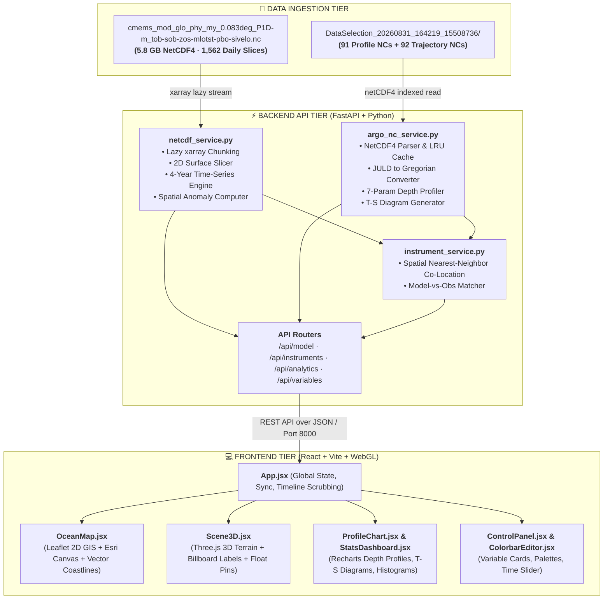

# 🌊 SAGAR-DRISHTI (सागर-दृष्टि — "Ocean Vision")

[](https://www.sih.gov.in/)
[](https://www.sih.gov.in/)
[](#)
[](#)
[](https://incois.gov.in/)
[](https://fastapi.tiangolo.com/)
[](https://threejs.org/)

> **A Web-Based, Browser-Native 3D Ocean Data Visualization & Analytics Platform Integrating Numerical Ocean Model Outputs with In-Situ Instrument Observations.**

---

## 📌 Executive Summary & Problem Statement

### 🏛️ Ministry & Department
- **Ministry**: Ministry of Earth Sciences (**MoES**), Government of India
- **Department / Organization**: Indian National Centre for Ocean Information Services (**INCOIS**), Hyderabad
- **Problem Statement Title**: *Develop a web-based interactive 3D visualization platform that integrates numerical ocean model outputs and in-situ observations*
- **Theme**: Disaster Management & Marine Intelligence

---

### 🌊 The Operational Challenge
India’s Exclusive Economic Zone (EEZ) spans over **2.3 million km²** and its coastline is home to hundreds of millions of citizens vulnerable to tropical super-cyclones, storm surges, tsunamis, and marine heatwaves. To safeguard life, navigation, and fisheries, INCOIS generates high-resolution **numerical ocean model forecasts** (such as CMEMS/INDOFOS outputs) and operates an extensive network of **in-situ ocean observation platforms** (such as autonomous BGC-Argo floats and underwater gliders).

However, operational forecasters and ocean scientists face critical tooling bottlenecks:
1. **Desktop Silos & High Latency**: Existing analysis tools (e.g., Ocean Data View, MATLAB, ArcGIS) are desktop-bound, licensed, and isolated. Cross-checking a 5.8 GB NetCDF model prediction against real-time float data requires toggling across multiple tools, wasting critical minutes during emergency cyclone advisories.
2. **Lack of Integrated 3D/2D Co-Visualization**: No unified platform exists to view 3D volumetric ocean layers (temperature, salinity, currents, mixed layer depth) alongside real-world vertical sensor dive profiles on a single interactive timeline.
3. **Rigid Ingestion Pipelines**: Existing software cannot seamlessly ingest new sensor feeds (Argo, Gliders, CTD, Moored Buoys) without heavy re-engineering.
4. **Science Communication Barrier**: Non-specialists, disaster response officers, and students cannot easily comprehend complex 4D scientific grids without specialized training.

---

### 💡 The SAGAR-DRISHTI Solution
**SAGAR-DRISHTI (सागर-दृष्टि)** is a zero-install, browser-native 3D ocean intelligence platform. It acts as an interactive **"Google Earth for Oceanography"**, unifying high-dimensional numerical model forecasts with real in-situ observational ground truth into one synchronized 2D/3D geospatial workspace.

```
┌──────────────────────────────────────────────────────────────────────────────────────────────────┐
│                                   SAGAR-DRISHTI AT A GLANCE                                      │
├──────────────────────────────────────────────────────────────────────────────────────────────────┤
│  🛰️ Model Forecasts (CMEMS/INCOIS)  +  🤖 In-Situ Robots (Argo Floats & Gliders)                │
│  • 5.8 GB High-Res NetCDF Grid          • 91 Active Floats across Bay of Bengal & Arabian Sea    │
│  • 1,562 Daily Time Steps (4-Year Hist) • 7 Biogeochemical (BGC) Sensor Parameters Measured      │
│  • 6 Gridded Physical Variables         • Real Dive Profiles (0 to 2,000 meters depth)           │
│                                                                                                  │
│                                           ⬇️                                                     │
│                                                                                                  │
│  ⚡ Unified 3D WebGL Terrain + 2D High-Definition GIS + Real-Time Model Validation Analytics     │
└──────────────────────────────────────────────────────────────────────────────────────────────────┘
```

---

## 🌟 Key Platform Features

### 1. 🌐 3D WebGL Ocean Terrain & Volumetric Engine
- **Dynamic 3D Mesh Displacement**: Converts gridded ocean parameters into interactive 3D topographical terrains (e.g., warm thermal pools and eddy bumps rise dynamically, cold upwellings dip).
- **True Geographic Spatial Orientation**: West represents the Arabian Sea, East represents the Bay of Bengal, with 3D landmark billboards (Indian Peninsula, Sri Lanka, Lakshadweep, Andaman & Nicobar).
- **Surface-Anchored Float Pins**: 3D float markers sit dynamically upon the deformed terrain with glowing status halos.
- **Buttery 60 FPS Orbit Controls**: Fluid zoom, pan, pitch, and rotational exploration powered by Three.js.

### 2. 🗺️ 2D High-Definition GIS Ocean Engine
- **Esri Dark Gray Canvas**: High-contrast, publication-grade cartographic base.
- **Custom High-Precision Coastlines**: Handcrafted vector coastlines for the Indian Peninsula, Gulf of Khambhat, Sri Lanka, and island chains.
- **Dynamic Semi-Transparent Heatmaps**: 78% opacity color overlays over real bathymetry.
- **Interactive Coordinate Probes**: Click anywhere on the ocean surface to trigger instant 4-year temporal analysis.

### 3. 🤖 In-Situ BGC-Argo Explorer & Profile Charts
- **91 Real Bay of Bengal & Arabian Sea Floats**: Ingested directly from Coriolis GDAC NetCDF exports.
- **Multi-Parameter Vertical Profiles**: Interactive Recharts visualization across 7 parameters:
  - `TEMP` (In-situ Temperature °C)
  - `PSAL` (Practical Salinity PSU)
  - `DOXY` (Dissolved Oxygen $\mu\text{mol/kg}$)
  - `CHLA` (Chlorophyll-a $\text{mg/m}^3$)
  - `NITRATE` (Nitrate Nutrient $\mu\text{mol/kg}$)
  - `pH` (Ocean Acidity)
  - `BBP700` (Particle Backscattering $\text{m}^{-1}$)
- **T-S (Temperature-Salinity) Water Mass Diagrams**: Scatter analysis identifying unique water mass signatures and thermohaline stratification.
- **Float Trajectory Reconstruction**: Historical GPS drift path visualization across consecutive surfacing cycles.

### 4. 🎯 Automated Model-vs-Observation Co-Location
- **Spatial-Temporal Nearest-Neighbor Alignment**: When an Argo float is clicked, the backend matches the float's exact GPS coordinates and dive date against the numerical model grid.
- **Direct Validation Curves**: Plots the observed sensor profile against the model’s predicted value side-by-side on a common depth axis, enabling instant error diagnosis and forecast verification.

### 5. 📈 Multi-Year Analytics & Anomaly Detection
- **4-Year Rolling Time-Series**: Drill down through 1,562 daily time steps (2023–2026) for any ocean coordinate.
- **Real-Time Anomaly Computation**: Instant deviation analysis showing how today’s temperature or salinity compares to multi-year baselines (critical for cyclone heat potential).
- **Pearson Cross-Correlation**: Measure statistical relationships between ocean height (`zos`), bottom temperature (`tob`), and salinity (`sob`).
- **Spatial Histograms**: 20-bin statistical distribution charts for active ocean bounding boxes.

### 6. 🎨 Dynamic Semantic Color Management
- **Curated Oceanographic Palettes**:
  - 🔴 **Thermal**: Temperature fields (`#ff6b6b`)
  - 🩵 **Haline**: Salinity fields (`#4ecdc4`)
  - 🟢 **Chlorophyll**: Phytoplankton & bio-productivity (`#55efc4`)
  - 🔵 **Velocity**: Current speeds & surface elevation (`#74b9ff`)
- **Interactive Threshold Editor**: User-adjustable min/max clipping and linear/logarithmic transfer functions for isolating thermoclines or oxygen minimum zones (OMZ).

---

## 🏗️ System Architecture



---

## 📖 Scientific Variable & Parameter Reference

### 🛰️ CMEMS Numerical Model Variables (Gridded Fields)
| Code | Full Name | Standard Unit | Oceanographic Significance | Semantic Color |
|:---|:---|:---:|:---|:---:|
| **`tob`** | Temperature at Ocean Bottom | °C | Deep sea-floor thermal state; tracks benthic warming and deep thermohaline circulation. | 🔴 Coral Red (`#ff6b6b`) |
| **`sob`** | Salinity at Ocean Bottom | PSU | Deep water density driver; differentiates Antarctic Bottom Water from Indian Ocean Deep Water. | 🩵 Teal-Cyan (`#4ecdc4`) |
| **`zos`** | Sea Surface Height (SSH) | m | Dynamic sea surface topography; identifies cyclonic (cold core) and anticyclonic (warm core) eddies. | 🔵 Sky Blue (`#74b9ff`) |
| **`mlotst`** | Ocean Mixed Layer Thickness | m | Depth of the active turbulent surface layer; determines Ocean Heat Content (OHC) fueling cyclones. | 🟣 Purple (`#a29bfe`) |
| **`pbo`** | Sea Floor Pressure | dbar | Total water column mass exertion; sensitive to storm surge loading and tsunami propagation. | 🩷 Rose Pink (`#fd79a8`) |
| **`sivelo`** | Sea Ice Velocity | m/s | Cryospheric drift velocity (0 in tropical Indian waters; preserved for global pipeline compatibility). | ❄️ Ice Silver (`#dfe6e9`) |

### 🤖 BGC-Argo In-Situ Parameters (Vertical Dive Profiles)
| Parameter | Sensor Name | Standard Range | Why It Matters |
|:---|:---|:---:|:---|
| **`PRES`** | Pressure / Depth | $0 - 2000 \text{ dbar}$ | Vertical vertical coordinate ($1\text{ dbar} \approx 1\text{ m depth}$). |
| **`TEMP`** | In-situ Temperature | $2.0 - 32.0 \text{ }^\circ\text{C}$ | Ground truth thermal stratification; identifies thermocline barrier layers. |
| **`PSAL`** | Practical Salinity | $30.0 - 37.5 \text{ PSU}$ | Measured via inductive conductivity; reveals fresh river plumes from the Ganges/Brahmaputra. |
| **`DOXY`** | Dissolved Oxygen | $0 - 250 \text{ }\mu\text{mol/kg}$ | Identifies the Northern Indian Ocean **Oxygen Minimum Zone (OMZ)** critical for fisheries. |
| **`CHLA`** | Chlorophyll-a | $0.01 - 5.0 \text{ mg/m}^3$ | Optical fluorescence of phytoplankton; maps primary productivity and Potential Fishing Zones (PFZ). |
| **`NITRATE`**| Dissolved Nitrate | $0 - 45 \text{ }\mu\text{mol/kg}$ | Essential macronutrient; indicates coastal and equatorial upwelling events. |
| **`pH`** | Sea Water Acidity | $7.6 - 8.3$ | Monitors ocean acidification trends and coral reef ecosystem health. |
| **`BBP700`**| Backscattering at 700nm | $0.0001 - 0.006 \text{ m}^{-1}$ | Quantifies particulate organic carbon and suspended sediment concentration. |

---

## 🗂️ Project Repository Structure

```
sih26067-prototype/
├── backend/                             # High-Performance FastAPI Python Backend
│   ├── app/
│   │   ├── main.py                      # Application lifecycle, CORS, dataset pre-warming
│   │   ├── config.py                    # Metadata catalogues, semantic colors, bounding boxes
│   │   ├── schemas.py                   # Pydantic response models for API validation
│   │   ├── routers/
│   │   │   ├── model.py                 # 2D surface slices, anomalies, histograms, time-series
│   │   │   ├── instruments.py           # Argo float catalog, vertical profiles, trajectories, T-S
│   │   │   ├── analytics.py             # Cross-correlations, linear trends, spatial stats
│   │   │   └── variables.py             # Variable registry and time-dimension calendar
│   │   └── services/
│   │       ├── netcdf_service.py        # xarray-based NetCDF4 slicer and spatial aggregator
│   │       ├── argo_nc_service.py       # Coriolis NetCDF parser with LRU in-memory caching
│   │       └── instrument_service.py    # Spatial-temporal nearest-neighbor co-location service
│   ├── data/                            # Scientific datasets directory (ignored in git)
│   │   ├── analyze_argo.py              # Diagnostic utility for BGC float metadata
│   │   └── generate_sample_data.py      # Fallback synthetic generator for testing
│   └── requirements.txt                 # Backend dependencies (fastapi, xarray, netCDF4, numpy)
│
├── frontend/                            # Modern Vite + React + WebGL Client
│   ├── src/
│   │   ├── App.jsx                      # Root container, global sync, topbar metrics
│   │   ├── api.js                       # Axios API client connecting to backend
│   │   ├── main.jsx                     # React DOM entrypoint
│   │   ├── styles.css                   # Glassmorphic dark ocean theme & typography
│   │   ├── components/
│   │   │   ├── Scene3D.jsx              # Three.js 3D WebGL ocean terrain renderer
│   │   │   ├── OceanMap.jsx             # Leaflet 2D GIS map with custom Indian coastlines
│   │   │   ├── ProfileChart.jsx         # Recharts vertical profile curves & T-S scatter
│   │   │   ├── ControlPanel.jsx         # Variable cards, opacity, exaggeration, timeline
│   │   │   ├── ColorbarEditor.jsx       # Interactive colormap & threshold manager
│   │   │   └── StatsDashboard.jsx       # Real-time ocean metrics and anomaly cards
│   │   └── utils/
│   │       ├── colormap.js              # GPU-friendly colormap palettes & shaders
│   │       └── indiaCoastlines.js       # High-precision vector coordinates for Indian coast
│   ├── index.html                       # HTML5 template with Inter typography
│   ├── package.json                     # Frontend dependencies (three, leaflet, recharts, lucide)
│   └── vite.config.js                   # Vite bundler configuration & API reverse proxy
│
├── .gitignore                           # Git hygiene (strictly excludes data/ and heavy binaries)
├── PROJECT.md                           # Master technical guide & architectural documentation
├── README.md                            # Professional project overview & startup instructions
└── SAGAR-DRISHTI_SIH26067_Documentation.docx # Official SIH Synopsis, PRD & SRS specification package
```

---

## 🚀 Quick Start & Installation Guide

### Prerequisites
- **Python**: `3.10` or higher
- **Node.js**: `18.0.0` or higher (with `npm`)
- **Web Browser**: Any modern browser with WebGL 2.0 support (Chrome, Edge, Firefox, Safari)

---

### Step 1: Clone the Repository
```bash
git clone https://github.com/RutuRaj-1/Sagar_Drishti.git
cd Sagar_Drishti
```

---

### Step 2: Backend Setup (Python & FastAPI)
```bash
# Navigate to the backend directory
cd backend

# Create and activate virtual environment
python -m venv venv

# Windows:
.\venv\Scripts\activate
# Linux / macOS:
# source venv/bin/activate

# Install required dependencies
pip install -r requirements.txt

# Start the FastAPI server
uvicorn app.main:app --reload --port 8000
```
> **Backend Verification**: Open **[http://localhost:8000/docs](http://localhost:8000/docs)** to view the interactive OpenAPI (Swagger) documentation.

---

### Step 3: Frontend Setup (React & Vite)
Open a new terminal window:
```bash
# Navigate to the frontend directory
cd frontend

# Install Node modules
npm install

# Start the Vite development server
npm run dev
```

---

### Step 4: Launch the Application
Open your browser and navigate to:
```
http://localhost:5173
```

---

## 📡 REST API Reference

| Method | Endpoint | Description | Query Parameters |
|:---:|:---|:---|:---|
| `GET` | `/api/health` | Backend health status & pre-warmed cache verification | None |
| `GET` | `/api/variables` | Catalog of available variables, metadata, and semantic colors | None |
| `GET` | `/api/variables/dates` | Full list of 1,562 available daily time steps | None |
| `GET` | `/api/model/surface` | Gridded 2D ocean slice for specified variable & date | `variable`, `date`, `downsample` |
| `GET` | `/api/model/timeseries` | 4-year daily time-series at specific coordinates | `variable`, `lat`, `lon` |
| `GET` | `/api/model/anomaly` | Spatial anomaly deviation from 4-year baseline | `variable`, `date`, `downsample` |
| `GET` | `/api/model/stats` | Spatial summary statistics and 20-bin histogram | `variable`, `date` |
| `GET` | `/api/instruments` | Catalog of 91 Argo floats with coordinates and sensor modes | `type` (optional) |
| `GET` | `/api/instruments/{id}/profile` | Depth-vs-variable dive profile + model co-location | `param` (`TEMP`, `PSAL`, `DOXY`, etc.) |
| `GET` | `/api/instruments/{id}/ts` | Temperature-Salinity scatter data for water mass analysis | None |
| `GET` | `/api/instruments/{id}/trajectory` | Historical GPS surfacing path over time | None |
| `GET` | `/api/analytics/trends` | Multi-year linear trends and rate of change | `variable`, `lat`, `lon` |
| `GET` | `/api/analytics/correlations` | Pearson cross-correlation matrix across ocean variables | `lat`, `lon` |

---

## 🎯 Target User Personas & Real-World Impact

| User Persona | Role & Operational Context | Direct SAGAR-DRISHTI Benefit |
|:---|:---|:---|
| **Operational Duty Forecaster** *(INCOIS)* | 24/7 watch monitoring during cyclone season; issues early warnings and storm surge advisories. | Reduces model validation time from 15+ minutes of tool-switching to **under 30 seconds** via instant float co-location. |
| **Oceanographic Researcher** *(MoES / NIO / Universities)* | Analyzes deep-sea dynamics, Oxygen Minimum Zones (OMZ), and Arabian Sea warming trends. | Interactively explores full 4D water column structure with T-S diagrams and multi-parameter profile charts. |
| **Data & IT Administrator** *(INCOIS)* | Responsible for registering new sensor networks (moorings, HF-radar, gliders) and numerical model runs. | Schema-driven plugin architecture allows registering new NetCDF variables via JSON config **without code changes**. |
| **Disaster Management Officer** *(NDRF / SDMAs)* | Coordinates evacuation and port operations based on coastal sea conditions. | Intuitive 2D/3D visual maps provide clear situational awareness without requiring complex GIS software. |
| **Students & Science Communicators** | Academic learning, marine exhibitions, and public awareness. | Browser-native, interactive 3D ocean globe accessible on any laptop or classroom display. |

---

## 🔮 Extensibility & Production Roadmap

- [x] **Modular NetCDF Ingestion**: Zero-code onboarding of CF-compliant NetCDF files.
- [x] **BGC-Argo 7-Parameter Support**: Full support for physical and biochemical sensor floats.
- [x] **Model-vs-Observation Co-Location**: Automated spatial-temporal validation curves.
- [ ] **OGC WMS / WCS Compliance**: Standardized raster layer export for national GIS infrastructure.
- [ ] **Volumetric Isosurface Extraction**: Client-side Marching Cubes algorithm for 3D thermocline isosurfaces.
- [ ] **HF-Radar & Moored Buoy Ingestion**: Dedicated parsers for coastal radar currents and RAMA moored buoys.
- [ ] **Role-Based Access Control (RBAC)**: Distinct operational tiers for Forecasters, Researchers, and Public Outreach.

---

## Acknowledgments

- **Hackathon**: Smart India Hackathon (SIH 2026) — Software Edition
- **Problem Statement ID**: 26067
- **Sponsoring Organization**: Ministry of Earth Sciences (**MoES**), Government of India
- **Problem Owner**: Indian National Centre for Ocean Information Services (**INCOIS**)
- **Repository**: [https://github.com/RutuRaj-1/Sagar_Drishti](https://github.com/RutuRaj-1/Sagar_Drishti)

---
