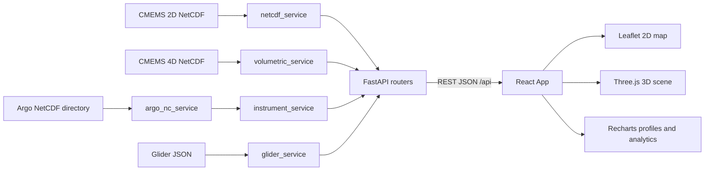

# SAGAR-DRISHTI

**सागर-दृष्टि (Ocean Vision)** is a browser-native ocean intelligence prototype for Smart India Hackathon 2026, Problem Statement `26067`. It combines Copernicus Marine model fields with Argo float and ocean glider observations in one interactive 2D GIS, 3D WebGL, profile-analysis, and statistics workspace.

The project addresses the MoES/INCOIS use case of rapidly inspecting ocean conditions, comparing model output with in-situ measurements, and communicating oceanographic signals to technical and non-technical decision makers.

> **Prototype status:** this is a local, file-backed demonstration. It has no database, authentication, background queue, or production deployment configuration. The backend reads supplied scientific files and serves derived JSON to the frontend.

## Contents

1. [Problem and solution](#problem-and-solution)
2. [Capabilities](#capabilities)
3. [Technology stack](#technology-stack)
4. [Architecture and request flow](#architecture-and-request-flow)
5. [Data sources](#data-sources)
6. [Repository guide](#repository-guide)
7. [Local setup](#local-setup)
8. [Complete product walkthrough](#complete-product-walkthrough)
9. [API reference](#api-reference)
10. [Processing and scientific methods](#processing-and-scientific-methods)
11. [Data utilities](#data-utilities)
12. [Validation and troubleshooting](#validation-and-troubleshooting)
13. [Limitations and next steps](#limitations-and-next-steps)

## Problem and solution

Forecasters and researchers need to compare numerical ocean model forecasts with autonomous observations. Conventional workflows require separate GIS, scientific plotting, and data-inspection tools. SAGAR-DRISHTI brings those steps into one browser interface:

- Inspect gridded ocean variables on a map for available dates.
- Animate the multi-year model timeline.
- Rotate the same field as an interactive 3D terrain surface.
- Inspect real Argo floats and glider missions.
- Compare an observed vertical profile with a co-located model profile.
- Inspect temperature-salinity relationships and sensor parameters.
- Calculate spatial statistics, temporal trends, anomalies, and correlations.
- Examine recent depth-resolved temperature, salinity, and current fields.

The main domain is the northern Indian Ocean, covering the Arabian Sea and Bay of Bengal at approximately `5-22°N, 68-95°E`.

## Capabilities

### 2D GIS visualization

- Leaflet map with Esri World Dark Gray base and reference tiles.
- Canvas-rendered raster overlay with configurable opacity, palette, range, and linear/log scaling.
- Hover probe for coordinates and nearest grid-cell values.
- Map click requests the full time series at the nearest grid point.
- Optional current-vector overlay with direction, speed, and color encoding.
- Argo and glider markers with profile actions.

### 3D WebGL visualization

- Three.js terrain mesh generated from the active horizontal field.
- Vertical exaggeration and layer-opacity controls.
- Orbit controls for zoom, pan, pitch, and rotation.
- 3D Argo/glider markers and geographic reference labels.
- Current cones based on `u/v` velocity vectors.
- Optional client-side Marching Cubes isosurface for recent 4D fields.

### In-situ explorer

- Directory of available Argo floats and glider missions.
- Depth profiles for temperature, salinity, oxygen, chlorophyll, nitrate, pH, and backscattering where available.
- Temperature-salinity diagram for Argo profiles containing both temperature and salinity.
- Model-versus-observation comparison.
- Summary of coordinates, basin, maximum depth, estimated mixed-layer depth, thermocline gradient, and validation errors.

### Analytics

- Spatial minimum, maximum, mean, standard deviation, median, percentiles, and histogram.
- Full time series at a selected location.
- Rolling mean and linear trend per year.
- Pearson correlation and `R²` between two variables at a location.
- Bounding-box region statistics.
- Anomaly field against the long-term time mean.

## Technology stack

| Layer | Technologies | Responsibility |
|---|---|---|
| UI | React 18, JavaScript ES modules | Component state and interface |
| Build/dev | Vite 5, `@vitejs/plugin-react` | Dev server, proxy, production bundle |
| 2D GIS | Leaflet 1.9, React Leaflet | Map, basemap, raster, markers, vectors |
| 3D | Three.js 0.160, WebGL, OrbitControls | Terrain, labels, markers, cones, isosurface |
| Charts | Recharts 2.12 | Profiles, T-S, trends, histograms, scatter plots |
| API | Python 3.10+, FastAPI 0.115, Uvicorn 0.30 | REST endpoints and OpenAPI docs |
| Scientific Python | xarray, netCDF4, NumPy, pandas, SciPy | NetCDF slicing and numerical analysis |
| Validation | Pydantic 2.9 | API data models and validation support |
| Formats | NetCDF-4/HDF5, JSON | Model, Argo, and glider data |

## Architecture and request flow



### Startup and data flow

1. `backend/app/main.py` creates FastAPI, enables permissive demo CORS, registers routers, and exposes health/root endpoints.
2. `frontend/src/App.jsx` checks health and loads variables, dates, volumetric metadata, Argo summaries, gliders, and trajectories.
3. The selected dataset mode determines whether the app requests a CMEMS surface slice or a 4D depth slice.
4. One React state model controls variable, date, depth, palette, color range, view, and overlays.
5. Components render returned JSON; the browser never reads NetCDF directly.

### Request paths

- **CMEMS mode:** `/api/model/surface` selects the nearest date, downsamples the field, and returns latitude/longitude/value arrays.
- **4D mode:** `/api/volumetric/depth-slice` snaps the requested date/depth to the nearest available coordinate.
- **Instrument selection:** the frontend requests a profile, then requests a model profile at the platform location/date.
- **Map click:** `/api/model/timeseries` returns the daily series at the nearest grid point.
- **Analytics:** `StatsDashboard` calls statistics, trend, and correlation endpoints for its selections.

## Data sources

The expected scientific assets live under `backend/data/`.

| Dataset | Source | Coverage/content | Local asset |
|---|---|---|---|
| CMEMS gridded field | Copernicus Marine Service | Daily field from `2022-06-01` through `2026-08-31`; surface/bottom variables | `cmems_Copernicus_Marine_Ocean_Dataset.nc` |
| CMEMS 4D field | Copernicus Marine ANFC | Recent `thetao`, `so`, `uo`, `vo` data for `2026-08-25` through `2026-08-31` | `real_ocean_model_4d.nc` |
| Argo profiles/trajectories | Coriolis GDAC / Argo Program | Profile and trajectory NetCDF files | `DataSelection_20260831_164219_15508736/` |
| Glider missions | IOOS Glider DAC ERDDAP / RU29 | Prepared mission JSON with four mission phases and CTD observations | `real_glider_tracks.json` |

The largest NetCDF assets may be excluded because of size. The backend does not create synthetic replacements when an expected file is absent.

### Variable catalogues

The CMEMS catalogue in `backend/app/config.py` supplies display names, units, descriptions, icons, palettes, and colors:

| Name | Meaning | Units | Palette |
|---|---|---|---|
| `tob` | Sea bottom temperature | °C | thermal |
| `sob` | Sea bottom salinity | PSU | haline |
| `zos` | Sea surface height | m | viridis |
| `mlotst` | Mixed-layer thickness | m | deep |
| `pbo` | Sea floor pressure | dbar | deep |
| `sivelo` | Derived surface drift velocity | m/s | speed |

The 4D API maps friendly names to NetCDF variables: `temperature -> thetao`, `salinity -> so`, `u_current -> uo`, and `v_current -> vo`.

## Repository guide

```text
sih26067-prototype/
├── backend/
│   ├── app/
│   │   ├── main.py                  FastAPI app, CORS, health, routers
│   │   ├── config.py                Dataset paths, metadata, palettes, limits
│   │   ├── schemas.py               Pydantic response models
│   │   ├── routers/                 HTTP endpoint modules
│   │   │   ├── variables.py         Metadata and date calendar
│   │   │   ├── model.py             2D slices, series, stats, anomalies
│   │   │   ├── volumetric.py        4D slices, currents, profiles, isosurfaces
│   │   │   ├── instruments.py       Argo profiles, trajectories, T-S data
│   │   │   ├── gliders.py            Glider list and profiles
│   │   │   └── analytics.py          Trends, correlations, region stats
│   │   └── services/                File readers and scientific operations
│   ├── data/                        Scientific assets and preparation scripts
│   └── requirements.txt              Python dependencies
├── frontend/
│   ├── src/
│   │   ├── App.jsx                  Global state and top-level tabs
│   │   ├── api.js                   Fetch wrapper for backend calls
│   │   ├── styles.css                Application styling
│   │   ├── components/              Map, 3D, controls, charts, summaries
│   │   └── utils/                   Colormaps, Marching Cubes, coastlines
│   ├── package.json                 Node dependencies and scripts
│   └── vite.config.js               Dev server and `/api` proxy
├── capture_all_views.py             Playwright screenshot helper
├── PROJECT.md                       Earlier technical reference
└── README.md                        This consolidated document
```

### Backend modules

- `netcdf_service.py`: opens the main CMEMS NetCDF with xarray, selects dates/coordinates, returns surface fields, time series, statistics, anomalies, and derives `sivelo`.
- `volumetric_service.py`: reads the recent depth-resolved CMEMS file, returns depth slices, current vectors, profiles, metadata, and scalar grids.
- `argo_nc_service.py`: parses Coriolis NetCDF profiles and trajectories, converts dates, exposes BGC parameters, T-S data, and cached reads.
- `instrument_service.py`: builds the Argo platform catalogue and performs model co-location for profile comparisons.
- `glider_service.py`: reads the prepared RU29 JSON mission data.
- `config.py`: centralizes paths, variable metadata, color semantics, cache/performance settings, and the time cap.
- `routers/*.py`: keep HTTP validation/error handling separate from file and numerical processing.

### Frontend modules

- `App.jsx`: bootstrap requests, active tab/mode state, dependent data fetching, selection flow, and shared palette state.
- `ControlPanel.jsx`: dataset mode, variables, date/depth sliders, playback, currents, isosurface, display, and color controls.
- `OceanMap.jsx`: Leaflet map, canvas raster, current arrows, coordinate hover/click, and instrument markers.
- `Scene3D.jsx`: persistent Three.js scene, height-field terrain, vertex colors, labels, raycast selection, cones, and isosurface.
- `ProfileChart.jsx`: Recharts depth/T-S views, observed/model interpolation, and profile diagnostics.
- `InstrumentSummaryPanel.jsx`: platform, reading, model-error, and plain-language oceanographic summaries.
- `StatsDashboard.jsx`: preset locations, statistics, trend, correlation, charts, and interpretations.
- `ColorbarEditor.jsx`: palette, range, and scale controls.
- `VariableExplanationCard.jsx`: contextual scientific explanation of the active variable.
- `colormap.js`: shared palettes and value-to-RGB mapping for 2D and 3D.
- `marchingCubes.js`: client-side extraction of an isosurface from a 3D scalar grid.

## Local setup

### Prerequisites

- Python 3.10 or newer.
- Node.js 18 or newer and npm.
- WebGL-capable browser for the 3D view.
- Expected files under `backend/data/`.
- Sufficient disk and memory for the large NetCDF assets, especially the 5.8 GB CMEMS file.

### Start the backend

From the repository root:

```powershell
cd backend
python -m venv .venv
.\.venv\Scripts\Activate.ps1
python -m pip install --upgrade pip
pip install -r requirements.txt
python -m uvicorn app.main:app --host 127.0.0.1 --port 8000 --reload
```

Command Prompt uses `\.venv\Scripts\activate.bat`; macOS/Linux uses `source .venv/bin/activate`.

Backend URLs:

- API root: `http://127.0.0.1:8000/`
- Swagger UI: `http://127.0.0.1:8000/docs`
- Health: `http://127.0.0.1:8000/api/health`

### Start the frontend

Open a second terminal at the repository root:

```powershell
cd frontend
npm install
npm run dev
```

Open `http://localhost:5173`. Vite proxies `/api` to `http://127.0.0.1:8000` using `frontend/vite.config.js`.

Production bundle:

```powershell
npm run build
npm run preview
```

Set `VITE_API_BASE` when the API is hosted at another origin, for example `VITE_API_BASE=http://127.0.0.1:8000`.

## Complete product walkthrough

This sequence can be used to explain the complete build during a review or demonstration.

### 1. Confirm connection

Open the frontend and check the top-bar status pill. On startup, `App.jsx` requests health, metadata, dates, volumetric metadata, Argo summaries, gliders, and trajectories. The top bar shows the active mode and instrument count. `API Offline` means the backend should be started or checked at `/docs`.

### 2. Explore the CMEMS 2D field

On `3D/2D Viewport`, keep `CMEMS 5.8GB` selected. Choose a variable, scrub the date slider, or use animate/reset/latest. Change colorbar range, palette, and opacity. Hover an ocean cell for the nearest value and click a point to request its time series. The raster is painted into a browser canvas; masked cells are transparent.

### 3. Turn on current vectors

Enable `Show Flow Vectors (u/v currents)`. In volumetric mode the arrows use real `uo` and `vo`; speed controls color and size, while direction controls orientation. The 2D arrows and 3D cones share the `speed` palette.

### 4. Inspect the 3D scene

Switch to 3D mode and rotate the Three.js scene. Longitude/latitude become horizontal scene coordinates, normalized values displace terrain vertices, and shared colormaps assign vertex colors. Increase vertical exaggeration to emphasize gradients. Enable the Marching Cubes isosurface and adjust its temperature threshold; the backend supplies the 3D grid and the browser extracts the shell.

### 5. Move through depth

Select `4D Multi-Depth`. The app switches to the volumetric variable and recent-date catalogues. Move the depth slider or choose a depth button. The selected horizontal slice updates the map and 3D terrain. Friendly variables are potential temperature, practical salinity, eastward current, and northward current.

### 6. Explore Argo and gliders

Open `Argo & Gliders`, search/filter the directory, and select a platform. The center chart loads observed profiles; the right panel shows identity, coordinates, date, basin, source, surface/deep readings, estimated mixed-layer depth, maximum depth, model errors, and a plain-language interpretation. Use the T-S tab for an Argo profile with both temperature and salinity.

### 7. Explain model versus observation

After profile selection, the frontend requests `/api/volumetric/profile` at the platform location and date. `ProfileChart.jsx` interpolates the model series onto observation depths and overlays both curves. Bias, mean absolute error, and RMSE are computed from paired valid values. This makes the comparison a model-validation workflow rather than a model-only display.

### 8. Run analytics and anomalies

Open `Analytics & Anomalies`, select a primary variable, choose coordinates or a preset, set the rolling window, select a second variable, and refresh. The dashboard combines spatial statistics, histogram, multi-year series with rolling mean/trend, correlation scatter, and a written interpretation.

### 9. Recommended presentation order

1. Introduce the INCOIS problem and the single-browser solution.
2. Show a real CMEMS field in 2D and switch variables.
3. Enable vectors and animate time.
4. Rotate the 3D terrain and reveal an isosurface.
5. Switch to 4D mode and move through depth.
6. Select a glider/Argo platform and show profile/co-location.
7. Finish with analytics, provenance, and the service architecture.

## API reference

All endpoints return JSON. Interactive documentation is available at `/docs`.

### Health and metadata

| Method and path | Purpose |
|---|---|
| `GET /` | API identity and example links |
| `GET /api/health` | Service status, version, domain, and time range |
| `GET /api/variables` | CMEMS variables and dataset metadata |
| `GET /api/variables/dates` | Available CMEMS dates |

### 2D model

| Method and path | Query parameters | Purpose |
|---|---|---|
| `GET /api/model/surface` | `variable`, `date`, `downsample` | Horizontal field as lat/lon/value arrays |
| `GET /api/model/timeseries` | `variable`, `lat`, `lon` | Daily series at nearest grid point |
| `GET /api/model/stats` | `variable`, `date` | Domain statistics and 20-bin histogram |
| `GET /api/model/anomaly` | `variable`, `date`, `downsample` | Field minus long-term mean |

Example: `http://127.0.0.1:8000/api/model/surface?variable=tob&date=2024-01-01&downsample=4`

### 4D volumetric

| Method and path | Query parameters | Purpose |
|---|---|---|
| `GET /api/volumetric/meta` | none | Variables, dates, depths, and extent |
| `GET /api/volumetric/depth-slice` | `variable`, `date`, `depth`, `downsample` | Horizontal slice at nearest depth/date |
| `GET /api/volumetric/currents` | `date`, `depth`, `downsample` | `uo/vo` vectors with speed and angle |
| `GET /api/volumetric/profile` | `lat`, `lon`, `date`, `variable` | Full vertical model profile |
| `GET /api/volumetric/isosurface` | `variable`, `date`, `max_depth` | 3D scalar grid for browser extraction |

### Argo and gliders

| Method and path | Purpose |
|---|---|
| `GET /api/instruments` | Argo platform list; optional bbox filters |
| `GET /api/instruments/{id}/profile` | Profile and BGC values; optional `compare_variable` |
| `GET /api/instruments/{id}/trajectory` | One float GPS track |
| `GET /api/instruments/{id}/tsdiagram` | Paired temperature-salinity points |
| `GET /api/instruments/trajectories/all` | All float tracks |
| `GET /api/gliders` | Prepared glider mission list |
| `GET /api/gliders/{id}/profile` | One glider depth profile |

### Analytics

| Method and path | Query parameters | Purpose |
|---|---|---|
| `GET /api/analytics/trend` | `variable`, `lat`, `lon`, `window` | Series, rolling mean, regression, slope/year |
| `GET /api/analytics/correlation` | `var1`, `var2`, `lat`, `lon` | Pearson `r`, `R²`, and scatter data |
| `GET /api/analytics/region_stats` | `variable`, `date`, bbox | Statistics over a bounding box |

## Processing and scientific methods

### Nearest-grid-point co-location

For platform coordinate $(\phi_p, \lambda_p)$, services select the nearest model latitude, longitude, and time:

$$
(\phi^*, \lambda^*, t^*) = \arg\min_{\phi_i,\lambda_j,t_k} (|\phi_i-\phi_p|, |\lambda_j-\lambda_p|, |t_k-t_p|)
$$

The current implementation uses xarray nearest-coordinate selection; it does not invent a higher-resolution model value.

### Surface drift velocity

`sivelo` is derived from sea surface height gradients. With height $\eta$, gravity $g$, and Coriolis parameter $f$:

$$
u_g = -\frac{g}{f}\frac{\partial\eta}{\partial y}, \qquad v_g = \frac{g}{f}\frac{\partial\eta}{\partial x}
$$

$$
\mathrm{sivelo} = \sqrt{u_g^2 + v_g^2}
$$

The resulting speed is encoded using the shared `speed` palette; it is a derived kinematic field, not a raw sea-ice velocity display.

### Anomaly, trend, and correlation

The anomaly is calculated pixel-wise against the available time mean:

$$
\Delta V_{i,j}(t) = V_{i,j}(t) - \frac{1}{N}\sum_{k=1}^{N} V_{i,j}(t_k)
$$

Trend processing computes a rolling mean and least-squares regression. Correlation removes rows where either variable is missing, calculates Pearson correlation, and returns at most 200 scatter points for browser efficiency.

### Shared color semantics

`frontend/src/utils/colormap.js` is the color authority. `colorForValue()` is used by the Leaflet canvas raster and Three.js terrain/vector renderers. `App.jsx` changes palette on variable changes, while `ColorbarEditor.jsx` exposes range and scale controls. The same value therefore has the same visual meaning in map, terrain, vectors, and legend.

### 3D rendering

`Scene3D.jsx` maintains one Three.js scene and rebuilds data groups when surface, palette, range, depth, or overlays change. A normalized value displaces the terrain mesh; instrument geometry is selectable through raycasting; `extractIsosurface()` creates the optional volumetric shell.

## Data utilities

| Script | Role |
|---|---|
| `backend/data/build_real_gliders.py` | Build/update prepared RU29 glider JSON from IOOS ERDDAP |
| `backend/data/fetch_real_gliders.py` | Fetch glider data from ERDDAP |
| `backend/data/analyze_argo.py` | Inspect Argo files and metadata |
| `backend/data/test_argo.py` | Data-level Argo check |
| `backend/data/merge_aug2026_4d.py` | Merge downloaded CMEMS 4D source files |
| `capture_all_views.py` | Capture principal UI screens with Playwright/Chrome |

Rebuild the prepared glider asset from the repository root:

```powershell
python backend/data/build_real_gliders.py
```

The 4D merge workflow requires relevant Copernicus Marine downloads and credentials/tooling; it is not required for normal startup.

## Validation and troubleshooting

With the backend running:

```powershell
Invoke-RestMethod http://127.0.0.1:8000/api/health
Invoke-RestMethod http://127.0.0.1:8000/api/variables
Invoke-RestMethod http://127.0.0.1:8000/api/volumetric/meta
Invoke-RestMethod http://127.0.0.1:8000/api/gliders
```

Then validate the frontend bundle:

```powershell
cd frontend
npm run build
```

Common issues:

- **API Offline:** ensure Uvicorn is listening on port `8000`; Vite targets `127.0.0.1`.
- **Dataset errors:** check exact filenames and directory layout under `backend/data/`.
- **Slow first request:** large NetCDF reads can be slow; service-level caching improves repeated reads.
- **Blank map cells:** masked/NaN cells are intentionally transparent.
- **No analytics:** click an ocean cell inside the configured domain.
- **Blank 3D view:** use a WebGL-capable browser and verify the viewport has size.
- **CORS:** all origins are allowed for this demo; restrict them before deployment.

## Limitations and next steps

Current prototype limitations:

- Large scientific files are local dependencies rather than managed object storage.
- CORS is wide open and there is no authentication, authorization, audit trail, or persistence.
- Large volumetric responses are JSON arrays and can be expensive to transfer.
- Co-location uses nearest coordinates and does not yet expose interpolation or uncertainty.
- Glider preparation is separate from runtime and depends on external ERDDAP.
- No automated test suite or CI configuration is included.

Recommended production work:

1. Move datasets to object storage and add a controlled catalog/cache service.
2. Stream tiled/chunked fields instead of large JSON arrays.
3. Add production CORS, auth, rate limits, structured logging, and monitoring.
4. Add interpolation, quality flags, uncertainty, and provenance to responses.
5. Add backend contract/data tests, frontend tests, and browser smoke tests.
6. Add live adapters for INCOIS, HF radar, moorings, CTD, and glider feeds.
7. Add deployment manifests and monitoring for memory, latency, freshness, and ingestion failures.

## Credits and provenance

Developed for Smart India Hackathon 2026, Problem Statement `26067`, for the MoES/INCOIS ocean-model and in-situ-observation integration use case.

Primary data provenance: Copernicus Marine Service, Coriolis GDAC / Argo Program, and IOOS Glider DAC / Rutgers RU29 source data. Consult source dataset terms and attribution requirements before redistribution or production deployment.