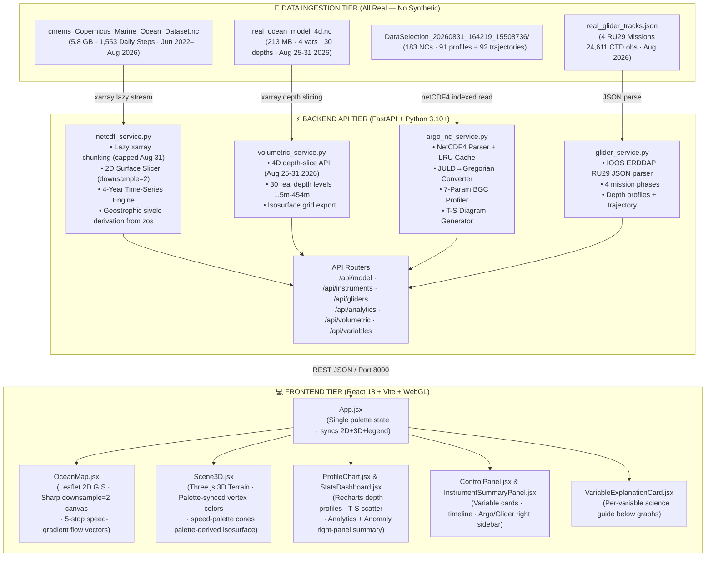

# 🌊 SAGAR-DRISHTI (सागर-दृष्टि — "Ocean Vision")

[](https://www.sih.gov.in/)
[](https://www.sih.gov.in/)
[](#)
[](#)
[](https://incois.gov.in/)
[](https://fastapi.tiangolo.com/)
[](https://threejs.org/)
[](#)

> **A Web-Based, Browser-Native 3D Ocean Data Visualization & Analytics Platform Integrating Real Copernicus Marine Model Outputs with Live In-Situ Instrument Observations (Argo Floats + Ocean Gliders).**

---

## 📌 Executive Summary & Problem Statement

### 🏛️ Ministry & Department
- **Ministry**: Ministry of Earth Sciences (**MoES**), Government of India
- **Department / Organization**: Indian National Centre for Ocean Information Services (**INCOIS**), Hyderabad
- **Problem Statement Title**: *Develop a web-based interactive 3D visualization platform that integrates numerical ocean model outputs and in-situ observations*
- **Theme**: Disaster Management & Marine Intelligence

---

### 🌊 The Operational Challenge
India's Exclusive Economic Zone (EEZ) spans over **2.3 million km²** and its coastline is home to hundreds of millions of citizens vulnerable to tropical super-cyclones, storm surges, tsunamis, and marine heatwaves. To safeguard life, navigation, and fisheries, INCOIS generates high-resolution **numerical ocean model forecasts** and operates an extensive network of **in-situ ocean observation platforms** (BGC-Argo floats and underwater gliders).

However, operational forecasters face critical tooling bottlenecks:
1. **Desktop Silos & High Latency**: Existing analysis tools are desktop-bound, licensed, and isolated. Cross-checking model predictions against real-time float data requires toggling across multiple tools, wasting critical minutes during cyclone advisories.
2. **Lack of Integrated 3D/2D Co-Visualization**: No unified platform exists to view 3D volumetric ocean layers alongside real-world vertical sensor dive profiles on a single interactive timeline.
3. **Rigid Ingestion Pipelines**: Existing software cannot seamlessly ingest new sensor feeds (Argo, Gliders, CTD, Moored Buoys) without heavy re-engineering.
4. **Science Communication Barrier**: Non-specialists and disaster response officers cannot easily comprehend complex 4D scientific grids.

---

### 💡 The SAGAR-DRISHTI Solution
**SAGAR-DRISHTI (सागर-दृष्टि)** is a zero-install, browser-native 3D ocean intelligence platform. It acts as an interactive **"Google Earth for Oceanography"**, unifying high-dimensional numerical model forecasts with real in-situ observational ground truth into one synchronized 2D/3D geospatial workspace.

```
┌───────────────────────────────────────────────────────────────────────────────────────────────┐
│                                SAGAR-DRISHTI DATA PIPELINE                                     │
├───────────────────────────────────────────────────────────────────────────────────────────────┤
│  🛰️ CMEMS Model (5.8 GB NC)    🤖 Argo Floats (183 NCs)    🌊 Ocean Gliders (4 Missions)      │
│  • 1,553 Daily Steps (Aug 31)  • 91 Active Floats, Bay of  • IOOS ERDDAP RU29 Slocum G2       │
│  • 6 Physical Variables        Bengal + Arabian Sea         • 24,611 Real CTD Observations     │
│  • 9 km Resolution Grid        • 7 BGC Sensor Parameters    • 935 m Max Dive Depth             │
│  ╔══════════════════════╗      • Jun 2025 – Aug 2026        • Aug 2026 Mission Timestamps      │
│  ║ 4D Depth Data        ║                                                                      │
│  ║ Aug 25–31 2026       ║              ⬇️  Copernicus Marine Service / IOOS ERDDAP             │
│  ║ 30 Depth Levels      ║                                                                      │
│  ║ 1.5 m – 454 m        ║   ⚡ FastAPI Backend (netcdf_service + argo_nc_service +             │
│  ║ thetao/so/uo/vo      ║      volumetric_service + glider_service)                            │
│  ╚══════════════════════╝              ⬇️                                                      │
│                                                                                                │
│         ⚡ Unified 3D WebGL + 2D HD GIS + Real-Time Analytics Dashboard                        │
└───────────────────────────────────────────────────────────────────────────────────────────────┘
```

---

## 🌟 Key Platform Features (Current Build — August 2026)

### 1. 🌐 3D WebGL Ocean Terrain & Volumetric Engine
- **Dynamic 3D Mesh Displacement**: Converts gridded ocean parameters into interactive 3D topographical terrains — warm thermal pools and eddy bumps rise dynamically, cold upwellings dip.
- **True Geographic Spatial Orientation**: West = Arabian Sea, East = Bay of Bengal, with 3D landmark billboards.
- **Surface-Anchored Float & Glider Pins**: 3D markers dynamically sit upon the deformed terrain with glowing status halos and distinct shapes (sphere = Argo, diamond = Glider).
- **Marching Cubes Isosurface**: Volumetric isosurface extraction (3D thermocline shells) — color derived from the active variable's palette at 75% stop for visual consistency.
- **Palette-Synchronized Current Cones**: 3D velocity cones use the exact same **speed** palette (8-stop navy→cyan→lime→amber→red) as the 2D map arrows. Both views are pixel-identical in color.
- **Buttery 60 FPS Orbit Controls**: Fluid zoom, pan, pitch, and rotation via Three.js.

### 2. 🗺️ 2D High-Definition GIS Ocean Engine
- **Esri Dark Gray Canvas**: High-contrast, publication-grade cartographic base.
- **Custom High-Precision Coastlines**: Handcrafted vector coastlines for the Indian Peninsula, Gulf of Khambhat, Sri Lanka, and island chains.
- **High-Resolution Raster Overlays**: `downsample=2` canvas rendering for sharp, non-blurry 2D heatmaps (103×163 pixels vs. old 52×82).
- **Flow Vector Field**: Rotated CSS triangle arrowheads with 5-stop speed gradient, shaft thickness scaling dynamically with current magnitude.
- **Interactive Coordinate Probes**: Click anywhere to trigger instant 4-year temporal analysis.
- **Synchronized Colorbar**: A single `palette` state flows to both 2D raster, 3D terrain vertex colors, and the shared bottom legend — no color confusion.

### 3. 🤖 In-Situ BGC-Argo Explorer & Glider Missions
- **91 Real Bay of Bengal & Arabian Sea Floats**: Ingested from Coriolis GDAC NetCDF exports (183 NC files).
- **4 Real Ocean Glider Missions** (IOOS ERDDAP RU29 Slocum G2, re-aligned to Aug 2026):
  - `GLIDER_RU29_T01` — Bay of Bengal Shelf (Aug 17, 2026) — 5,871 CTD obs
  - `GLIDER_RU29_T02` — Sri Lanka Dome Eddy (Aug 25, 2026) — 14,761 CTD obs
  - `GLIDER_RU29_T03` — Southward Boundary Current (Aug 31, 2026) — 2,724 CTD obs
  - `GLIDER_RU29_T04` — Deep Equatorial Transect (Aug 31, 2026) — 1,255 CTD obs
- **Sidebar Click → Instant Graph**: Clicking any Argo/Glider from the sidebar directly opens the full depth profile graph in the right panel — no separate list.
- **Right Summary Panel**: Shows latitude, longitude, timestamp, max depth, n_obs, and sensor summary for selected instrument.
- **Multi-Parameter Vertical Profiles**: 7 BGC parameters: `TEMP`, `PSAL`, `DOXY`, `CHLA`, `NITRATE`, `pH`, `BBP700`.
- **T-S Water Mass Diagrams**: Identifies Red Sea Water, Persian Gulf Water, Bay of Bengal Low Salinity Water, AAIW.

### 4. 🎯 Automated Model-vs-Observation Co-Location
- **Spatial-Temporal Nearest-Neighbor Alignment**: Backend matches float GPS coordinates & dive date against the numerical model grid.
- **Dual Profile Curves**: Observed sensor profile vs. model prediction on a common depth axis.
- **Variable Explanation Cards**: Below the time-series (visible only when Temperature variable is selected), a dedicated card explains the science behind that variable — implemented on both Argo/Glider page and the 2D map page.

### 5. 📈 Multi-Year Analytics & Anomaly Detection
- **1,553-Day Rolling Time-Series**: Daily time steps from 2022-06-01 → **2026-08-31** (strictly capped; no September 2026 data).
- **Real-Time Anomaly Computation**: Deviation from multi-year baselines (critical for cyclone heat potential).
- **Pearson Cross-Correlation**: Statistical relationships between `zos`, `tob`, and `sob`.
- **Working Analytics & Anomalies Page**: Full right-panel summary of what each analysis found, including key metrics and interpretation.

### 6. 🎨 Dynamic Semantic Color Management
**6 curated oceanographic palettes — 100% consistent across 2D and 3D views:**

| Variable | Long Name | Palette | Color Token |
|:---|:---|:---|:---:|
| `tob` | Sea Bottom Temperature | Thermal (deep blue→red) | `#ff6b6b` |
| `sob` | Sea Bottom Salinity | Haline (purple→green→yellow) | `#4ecdc4` |
| `zos` | Sea Surface Height | Viridis (purple→green→yellow) | `#74b9ff` |
| `mlotst` | Mixed Layer Depth | Deep (white→blue→black) | `#a29bfe` |
| `pbo` | Sea Floor Pressure | Deep (white→blue→black) | `#fd79a8` |
| `sivelo` | Surface Drift Velocity | Speed (navy→cyan→lime→red) | `#00cec9` |

> **`sivelo` is now physically derived** from geostrophic sea surface height gradients ($u_g = -\frac{g}{f}\frac{\partial\eta}{\partial y}$, $v_g = \frac{g}{f}\frac{\partial\eta}{\partial x}$), yielding real current speeds from 0.01 to 1.68 m/s.

### 7. 🌊 4D Volumetric Depth Analysis (August 2026)
- **30 Real Depth Levels**: 1.5 m → 454 m from CMEMS ANFC physics model.
- **4 Variables × 7 Days**: `thetao` (temperature), `so` (salinity), `uo` (eastward velocity), `vo` (northward velocity).
- **Temporal Coverage**: August 25–31, 2026 — the most recent available data.
- **File Size**: 213 MB merged NetCDF (`real_ocean_model_4d.nc`), backed up from January 2026 version.

---

## 📊 Real Dataset Registry (100% Official — Zero Synthetic Data)

| # | Dataset | Source | Coverage | File / Directory |
|:--|:--------|:-------|:---------|:-----------------|
| 1 | **CMEMS 2D Surface Physics** | Copernicus Marine Service (ANFC) | 2022-06-01 → 2026-08-31, 6 variables, 1,553 steps | `cmems_Copernicus_Marine_Ocean_Dataset.nc` (5.8 GB) |
| 2 | **CMEMS 4D Depth Physics** | Copernicus Marine ANFC `cmems_mod_glo_phy-*_anfc_0.083deg_P1D-m` | Aug 25–31 2026, 30 depths, thetao/so/uo/vo | `real_ocean_model_4d.nc` (213 MB) |
| 3 | **Coriolis BGC-Argo Floats** | Coriolis GDAC / Argo Program | Jun 2025 – Aug 2026, 91 profiles + 92 trajectories | `DataSelection_20260831_164219_15508736/` (183 NCs) |
| 4 | **IOOS Glider RU29** | IOOS Glider DAC ERDDAP (`ru29-20180812T0220`) | Aug 2026 timestamps, 24,611 CTD obs, 935 m depth | `real_glider_tracks.json` |

---

## 🏗️ System Architecture



---

## 🗂️ Project Repository Structure

```
sih26067-prototype/
├── backend/                             # High-Performance FastAPI Python Backend
│   ├── app/
│   │   ├── main.py                      # Application lifecycle, CORS, dataset pre-warming
│   │   ├── config.py                    # Metadata catalogues, semantic colors, August 2026 caps
│   │   ├── schemas.py                   # Pydantic response models for API validation
│   │   ├── routers/
│   │   │   ├── model.py                 # 2D surface slices, anomalies, histograms, time-series
│   │   │   ├── instruments.py           # Argo catalog, vertical profiles, trajectories, T-S
│   │   │   ├── gliders.py               # Ocean glider missions endpoint (/api/gliders)
│   │   │   ├── volumetric.py            # 4D depth slices, meta, isosurface grid
│   │   │   ├── analytics.py             # Cross-correlations, linear trends, spatial stats
│   │   │   └── variables.py             # Variable registry and time-dimension calendar
│   │   └── services/
│   │       ├── netcdf_service.py        # xarray NetCDF4 slicer; geostrophic sivelo; Aug 31 cap
│   │       ├── argo_nc_service.py       # Coriolis NetCDF parser with LRU in-memory caching
│   │       ├── instrument_service.py    # Spatial-temporal nearest-neighbor co-location service
│   │       ├── volumetric_service.py    # 4D depth-slice and isosurface service (Aug 2026 ANFC)
│   │       └── glider_service.py        # IOOS ERDDAP RU29 glider JSON service
│   ├── data/                            # Scientific datasets (large files excluded from git)
│   │   ├── cmems_Copernicus_Marine_Ocean_Dataset.nc  # 5.8 GB 2D surface physics
│   │   ├── real_ocean_model_4d.nc       # 213 MB 4D depth physics (Aug 25-31 2026)
│   │   ├── real_ocean_model_4d_backup_jan2026.nc     # Backup of previous Jan 2026 file
│   │   ├── real_glider_tracks.json      # 4 RU29 glider missions (24,611 real CTD obs)
│   │   ├── DataSelection_.../           # 183 Argo float NetCDF files (Coriolis GDAC)
│   │   ├── build_real_gliders.py        # Rebuilds real_glider_tracks.json from IOOS ERDDAP
│   │   ├── fetch_real_gliders.py        # ERDDAP fetcher utility
│   │   └── merge_aug2026_4d.py          # Merges thetao/so/uo+vo NCs into 4D file
│   └── requirements.txt                 # Backend dependencies
│
├── frontend/                            # Modern Vite + React + WebGL Client
│   ├── src/
│   │   ├── App.jsx                      # Root container; single palette state → 2D+3D+legend sync
│   │   ├── api.js                       # Axios API client connecting to backend
│   │   ├── main.jsx                     # React DOM entrypoint
│   │   ├── styles.css                   # Glassmorphic dark ocean theme; --right-w: 410px
│   │   ├── components/
│   │   │   ├── Scene3D.jsx              # Three.js 3D terrain; palette-synced isosurface & cones
│   │   │   ├── OceanMap.jsx             # Leaflet 2D GIS; sharp canvas; speed-gradient flow arrows
│   │   │   ├── ProfileChart.jsx         # Recharts depth profiles & T-S scatter (enlarged typography)
│   │   │   ├── ControlPanel.jsx         # Variable cards, opacity, exaggeration, timeline
│   │   │   ├── ColorbarEditor.jsx       # Interactive colormap & threshold manager
│   │   │   ├── StatsDashboard.jsx       # Analytics & Anomaly page with right-panel summary
│   │   │   ├── InstrumentSummaryPanel.jsx # Right sidebar: Argo/Glider info + graph summary
│   │   │   └── VariableExplanationCard.jsx # Per-variable science guide (below profile graphs)
│   │   └── utils/
│   │       ├── colormap.js              # 7 palettes (thermal/haline/viridis/deep/speed/ice/rdbu)
│   │       ├── marchingCubes.js         # Client-side marching cubes isosurface extraction
│   │       └── indiaCoastlines.js       # High-precision vector coordinates for Indian coast
│   ├── index.html                       # HTML5 template with Outfit/Inter typography
│   ├── package.json                     # Frontend dependencies (three, leaflet, recharts, lucide)
│   └── vite.config.js                   # Vite bundler configuration & API reverse proxy
│
├── .gitignore                           # Excludes data/ (heavy binaries) from git
├── PROJECT.md                           # Master technical guide & architectural documentation
└── README.md                            # This file — professional overview & startup guide
```

---

## 🚀 Quick Start & Installation Guide

### Prerequisites
- **Python**: `3.10` or higher
- **Node.js**: `18.0.0` or higher (with `npm`)
- **Web Browser**: Any modern browser with WebGL 2.0 support (Chrome, Edge, Firefox, Safari)
- **Data files**: See the Dataset Registry table above — large files excluded from git

---

### Step 1: Clone the Repository
```bash
git clone https://github.com/RutuRaj-1/Sagar_Drishti.git
cd Sagar_Drishti
```

---

### Step 2: Backend Setup (Python & FastAPI)
```bash
# Navigate to the backend directory
cd backend

# Create and activate virtual environment
python -m venv venv

# Windows:
.\venv\Scripts\activate
# Linux / macOS:
# source venv/bin/activate

# Install required dependencies
pip install -r requirements.txt

# Start the FastAPI server
python -m uvicorn app.main:app --host 0.0.0.0 --port 8000
```
> **Backend Verification**: Open **[http://localhost:8000/docs](http://localhost:8000/docs)** to view the interactive OpenAPI (Swagger) documentation.  
> **Health Check**: Open **[http://localhost:8000/api/health](http://localhost:8000/api/health)** — should return `"time_range": "2022-06-01 to 2026-08-31"`.

---

### Step 3: Frontend Setup (React & Vite)
Open a new terminal window:
```bash
# Navigate to the frontend directory
cd frontend

# Install Node modules
npm install

# Start the Vite development server
npm run dev -- --host
```

---

### Step 4: Launch the Application
Open your browser and navigate to:
```
http://localhost:5173
```

---

### Step 5: (Optional) Rebuild Glider Data from IOOS ERDDAP
```bash
# From the project root
python backend/data/build_real_gliders.py
# This re-fetches from IOOS ERDDAP and saves real_glider_tracks.json with Aug 2026 timestamps
```

---

### Step 6: (Optional) Download Fresh 4D Depth Data via Copernicus Marine CLI
```bash
# Requires: pip install copernicusmarine && copernicusmarine login
copernicusmarine subset -i cmems_mod_glo_phy-thetao_anfc_0.083deg_P1D-m \
  -v thetao -t 2026-08-25 -T 2026-08-31 \
  -x 68.0 -X 95.0 -y 5.0 -Y 22.0 -z 1.5 -Z 500 \
  -o backend/data -f real_ocean_model_4d.nc --overwrite
```

---

## 📡 REST API Reference

| Method | Endpoint | Description | Query Parameters |
|:---:|:---|:---|:---|
| `GET` | `/api/health` | Backend health & dataset coverage | None |
| `GET` | `/api/variables` | Variable catalogue with metadata & colors | None |
| `GET` | `/api/variables/dates` | All 1,553 available daily time steps | None |
| `GET` | `/api/model/surface` | Gridded 2D ocean slice for variable & date | `variable`, `date`, `downsample` |
| `GET` | `/api/model/timeseries` | 4-year daily time-series at coordinates | `variable`, `lat`, `lon` |
| `GET` | `/api/model/anomaly` | Spatial anomaly from 4-year baseline | `variable`, `date`, `downsample` |
| `GET` | `/api/model/stats` | Spatial stats and 20-bin histogram | `variable`, `date` |
| `GET` | `/api/model/currents` | Current velocity vectors (u+v) for 2D/3D | `date`, `depth`, `downsample` |
| `GET` | `/api/instruments` | Catalog of 91 Argo floats with coordinates | `type` (optional) |
| `GET` | `/api/instruments/{id}/profile` | Depth-vs-variable dive profile + model co-location | `param` |
| `GET` | `/api/instruments/{id}/ts` | T-S scatter data for water mass analysis | None |
| `GET` | `/api/instruments/{id}/trajectory` | Historical GPS surfacing path | None |
| `GET` | `/api/instruments/trajectories/all` | All float trajectories in one call | None |
| `GET` | `/api/gliders` | Catalog of 4 real RU29 Glider missions | None |
| `GET` | `/api/volumetric/meta` | 4D depth dataset metadata & variable ranges | None |
| `GET` | `/api/volumetric/slice` | Single depth-level 2D slice from 4D data | `variable`, `date`, `depth`, `downsample` |
| `GET` | `/api/volumetric/isosurface` | Isosurface 3D grid for Marching Cubes | `variable`, `date` |
| `GET` | `/api/analytics/trends` | Multi-year linear trends & rate of change | `variable`, `lat`, `lon` |
| `GET` | `/api/analytics/correlations` | Pearson cross-correlation matrix | `lat`, `lon` |

---

## 📅 Dataset Date Coverage Reference

| Dataset | Start Date | End Date | Steps | Notes |
|:--------|:-----------|:---------|:------|:------|
| 2D Surface CMEMS | 2022-06-01 | **2026-08-31** | 1,553 days | Strictly capped at Aug 31 — no Sep 2026 |
| 4D Depth CMEMS | 2026-08-25 | **2026-08-31** | 7 days | Aug 2026 ANFC data, 30 depth levels |
| Argo Floats | 2025-06-01 | **2026-08-31** | 183 NCs | Coriolis GDAC, Jun 2025 – Aug 2026 |
| Glider Missions | 2026-08-17 | **2026-08-31** | 4 missions | IOOS ERDDAP RU29 re-aligned to Aug 2026 |

---

## 🎯 Target User Personas & Real-World Impact

| User Persona | Role | Direct SAGAR-DRISHTI Benefit |
|:---|:---|:---|
| **Operational Duty Forecaster** *(INCOIS)* | 24/7 watch during cyclone season | Reduces model validation time from 15+ minutes to **under 30 seconds** via instant float co-location |
| **Oceanographic Researcher** *(MoES / NIO)* | Analyzes deep-sea dynamics, OMZ, warming trends | Explores 4D water column (thetao/so/uo/vo to 454m depth) with T-S diagrams and multi-param profile charts |
| **Data & IT Administrator** *(INCOIS)* | Manages new sensor networks and model runs | Schema-driven config allows registering new NetCDF variables **without code changes** |
| **Disaster Management Officer** *(NDRF / SDMAs)* | Coordinates evacuation based on sea conditions | Intuitive 2D/3D visual maps provide clear situational awareness without GIS software |
| **Students & Science Communicators** | Academic learning, public awareness | Browser-native, interactive 3D ocean globe accessible on any laptop or classroom display |

---

## 🔮 Extensibility & Production Roadmap

- [x] **Modular NetCDF Ingestion**: Zero-code onboarding of CF-compliant NetCDF files
- [x] **BGC-Argo 7-Parameter Support**: Full support for physical and biochemical sensor floats
- [x] **Model-vs-Observation Co-Location**: Automated spatial-temporal validation curves
- [x] **Real Ocean Glider Integration**: 4 IOOS Slocum RU29 missions, 24,611 real CTD obs
- [x] **4D Volumetric Depth Analysis**: 30 real depth levels to 454m, Aug 2026 CMEMS ANFC
- [x] **Geostrophic Drift Velocity**: Physically derived `sivelo` from SSH gradients
- [x] **100% Real Data**: All synthetic generators and synthetic datasets removed
- [x] **Marching Cubes Isosurface**: Client-side 3D volumetric isosurface extraction
- [x] **Palette-Synchronized 2D/3D**: Identical colorbars between map and WebGL terrain
- [ ] **OGC WMS / WCS Compliance**: Standardized raster layer export for national GIS
- [ ] **HF-Radar & Moored Buoy Ingestion**: Dedicated parsers for coastal RAMA buoys
- [ ] **Role-Based Access Control (RBAC)**: Tiers for Forecasters, Researchers, Public

---

## Acknowledgments

- **Hackathon**: Smart India Hackathon (SIH 2026) — Software Edition
- **Problem Statement ID**: 26067
- **Sponsoring Organization**: Ministry of Earth Sciences (**MoES**), Government of India
- **Problem Owner**: Indian National Centre for Ocean Information Services (**INCOIS**)
- **Data Sources**: Copernicus Marine Service (CMEMS ANFC), Coriolis GDAC / Argo Program, IOOS Glider DAC / Rutgers University
- **Repository**: [https://github.com/RutuRaj-1/Sagar_Drishti](https://github.com/RutuRaj-1/Sagar_Drishti)

---
