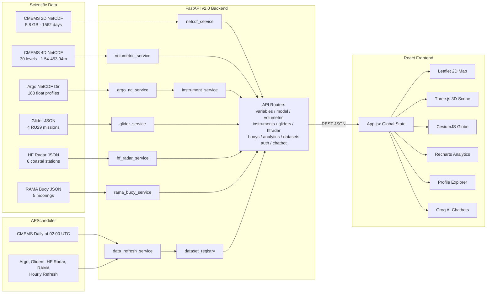

# SAGAR-DRISHTI (Ocean Vision)

<div align="center">

[](https://www.sih.gov.in/)
[](https://www.sih.gov.in/)
[](https://incois.gov.in/)
[](#)

[](https://www.python.org/)
[](https://fastapi.tiangolo.com/)
[](https://react.dev/)
[](https://threejs.org/)
[](https://cesium.com/)
[](https://firebase.google.com/)
[](https://vitejs.dev/)
[](https://groq.com/)
[](#)

**Browser-native, zero-install 3D/4D ocean intelligence platform unifying Copernicus Marine model forecasts, Argo floats, gliders, HF Radar, and RAMA buoys in a single workspace — powered by Groq AI.**

*Built for MoES / INCOIS: rapid ocean inspection, model-vs-observation validation, and science communication for operational forecasters and students.*

</div>

---

## The Problem

India's INCOIS monitors **2.3 million km2** of Exclusive Economic Zone with BGC-Argo floats, underwater gliders, HF Radar stations, RAMA moored buoys, and numerical ocean models. Forecasters must switch between GIS software, licensed data viewers, and bespoke scripts to cross-check model outputs against real observations — costing **15+ critical minutes** during cyclone advisories.

**SAGAR-DRISHTI** eliminates that gap. One browser tab. No installation. Real data. Full 2D/3D/4D co-visualization. AI-powered analysis.

---

## What It Does

```
+---------------------------------------------------------------------+
|              SAGAR-DRISHTI DATA PIPELINE v2.0                       |
+------------------+------------------+-------------------------------+
| CMEMS Model 2D   |  Argo Floats      |  Ocean Gliders               |
| 5.8 GB NetCDF    |  183 NC profiles  |  4 IOOS RU29 Missions        |
| 1,562 daily days |  91 active floats |  24,611 CTD observations     |
| 6 surface vars   |  7 BGC params     |  935 m max dive depth        |
| CMEMS 4D NetCDF  |  Jun 2025-Aug2026 |  Bay of Bengal + Arab. Sea   |
| 30 depth levels  +------------------+-------------------------------+
| 1.54 to 453.94m  |  HF Radar Network |  RAMA Buoys                  |
| thetao/so/uo/vo  |  6 Coastal Stn    |  5 Moorings INCOIS/NOAA      |
| Aug 25-31 2026   |  Hourly u/v       |  SST, SSS, Thermistor        |
+------------------+------------------+-------------------------------+
    CMEMS + Coriolis GDAC + IOOS ERDDAP + INCOIS HF Radar + NOAA PMEL
FastAPI v2.0 (Python, xarray, netCDF4, SciPy, APScheduler, Groq AI)
React 18 + Three.js WebGL + CesiumJS Globe + Leaflet GIS + Recharts
```

---

## Workspace Modes

| Mode | Access | Description |
|---|---|---|
| **Landing Page & RBAC Portal** | Public | Animated ocean entry portal with role-mode cards and Firebase Auth login, with local offline fallbacks |
| **Forecaster / Duty Mode** | `forecaster` role | Protected workspace: technical synopses, AI analysis, Pearson correlations, model skill meters (MAE & RMSE by depth layer), 4 guided expert workflows, Watch Logbook, and **Groq Llama Technical AI Co-Pilot** with live depth/stats context. Defaults to 4D Multi-Depth at **453.94 m** on load. |
| **Student / Explorer Mode** | All roles | Layman summaries, AI insights, depth zone bar, coastal comparisons, ocean health badge, 6-stop guided tour with voice narration, rotating facts, quiz, and **Groq Educational AI Ocean Assistant** with offline curriculum fallback |
| **2D GIS Map** | All roles | CMEMS variable as Leaflet heatmap overlay. Click any point for a 4-year time series. Animated current vectors. |
| **3D WebGL Terrain** | All roles | Three.js height-field terrain. Marching Cubes isosurface shells for thermocline visualization. |
| **CesiumJS Globe** | All roles | High-precision global and regional ocean views via CesiumJS / Resium |
| **Argo & Gliders** | All roles | 91 Argo floats + 4 glider missions. Click any platform for 7 BGC parameters + T-S water mass diagram + model co-location. |
| **HF Radar & RAMA** | All roles | 6 INCOIS coastal HF Radar stations with surface current vectors + 5 NOAA/INCOIS RAMA moored buoys with SST/SSS profiles |
| **Analytics & Anomalies** | All roles | Spatial statistics, 20-bin histograms, 4-year trend lines, rolling means, anomaly fields, and Pearson correlations at any grid point or bounding box |
| **Live Data Pipeline** | All roles | Real-time health dashboard showing ingestion status for all 6 dataset feeds |
| **Admin Panel** | `admin` role | Firestore user management: view, promote, demote, and remove user roles |

---

## Role-Based Access Control (RBAC)

Firebase Auth + Firestore for secure role-gated navigation:

| Role | Demo Username | Demo Password | Access |
|---|---|---|---|
| **Student / Explorer** | `student` | `student123` | Student Workspace, 3D globe, educational chatbot, guided tour |
| **Duty Forecaster** | `forecaster` | `forecast123` | Full Forecaster Workspace, 4D depth slices, model skill, HF Radar, AI Co-Pilot |
| **Admin** | Firebase only | Firebase only | All features + Firestore user management panel |
| **Public Guest** | (none) | (none) | Landing Page and Explorer. `/forecaster` triggers 403 AccessDenied screen |

---

## Technology Stack

### Backend

| Package | Version | Role |
|---|---|---|
| **Python** | `3.10+` | Runtime (tested on 3.14) |
| **FastAPI** | `0.115.0` | REST API, OpenAPI docs, async routing |
| **Uvicorn** | `0.30.6` | ASGI server |
| **APScheduler** | `>=3.10.4` | Background scheduler: hourly/daily data refresh jobs |
| **xarray** | `2024.9.0` | NetCDF-4 slicing and nearest-coordinate selection |
| **netCDF4** | `1.7.4` | Low-level HDF5/NetCDF read engine |
| **NumPy** | `2.3.5` | Numerical operations, sivelo gradient computation |
| **SciPy** | `1.16.1` | Interpolation, OLS regression, Pearson correlation |
| **pandas** | `2.3.3` | Time series manipulation and date parsing |
| **Pydantic** | `2.13.5` | Response model validation and schema generation |
| **requests** | `2.32.3` | Outbound HTTP for GDAC / IOOS ERDDAP fetching |
| **copernicusmarine** | `>=1.3.0` | CLI tool for downloading CMEMS NetCDF data |
| **python-dotenv** | `>=1.0.0` | Loads environment variables from `.env` |
| **Groq API** | Cloud | LLM inference: `openai/gpt-oss-120b`, `qwen/qwen3.8-27b` |

### Frontend

| Package | Version | Role |
|---|---|---|
| **React** | `18` | Component model, state management, tab navigation |
| **Vite** | `8` | Dev server, HMR, production bundle, `/api` proxy |
| **Three.js** | `0.160` | WebGL 3D terrain mesh, orbit controls, raycasting, isosurface |
| **CesiumJS** | `1.145` | High-precision 3D globe visualization (via `resium`) |
| **Leaflet** | `1.9` | 2D GIS tile map, canvas raster overlays, marker layers |
| **react-leaflet** | `4.2` | React bindings for Leaflet |
| **Recharts** | `2.12` | Depth profiles, T-S diagrams, time-series, histograms, scatter |
| **Firebase** | `12.18` | Authentication, Firestore RBAC, and Admin Panel |

### Data Formats

| Format | Where Used |
|---|---|
| **NetCDF-4 / HDF5** | CMEMS ocean model fields (2D surface + 4D volumetric), Argo float profiles |
| **JSON** | Glider tracks, HF Radar data, RAMA buoys, all API responses |

---

## Architecture



### How a Request Flows

1. `App.jsx` boots calling `/api/health`, `/api/variables`, `/api/variables/dates`, `/api/volumetric/meta`, `/api/instruments`, `/api/gliders`, `/api/instruments/trajectories/all`, `/api/hfradar`, and `/api/buoys` in parallel.
2. User selects variable + date → calls `/api/model/surface?variable=tob&date=2026-08-01&downsample=2`.
3. `netcdf_service` opens the CMEMS NetCDF via `xarray.open_dataset()`, selects nearest time coordinate, downsamples the 2D field, masks NaN (land) cells, returns `{lats, lons, values}`.
4. `OceanMap.jsx` paints the field into a `<canvas>` overlaid on the Leaflet tile map via `imageOverlay`.
5. `Scene3D.jsx` simultaneously rebuilds a Three.js `PlaneGeometry` with vertex Y-displacements from normalized values, applying the shared `colormap.js` palette.
6. Clicking a map point calls `/api/model/timeseries` → Recharts renders the full 1,562-day series.
7. Switching to **Forecaster Mode** automatically sets `datasetMode = volumetric` and `depthIndex = 29` (453.94 m), and initializes the AI Co-Pilot with live stats context.
8. Chatbot queries flow: React → FastAPI `/api/student/chat` or `/api/forecaster/chat` → Groq Cloud → markdown response rendered in-app. On backend failure: direct browser Groq call. On internet failure: offline knowledge base.

---

## Repository Layout

```
sih26067-prototype/
|
+-- backend/
|   +-- app/
|   |   +-- main.py                      # FastAPI app factory v2.0, CORS, lifespan, APScheduler init
|   |   +-- config.py                    # Dataset paths, variable metadata, Groq keys, CORS origins
|   |   +-- schemas.py                   # Pydantic response models for every endpoint
|   |   +-- scheduler.py                 # APScheduler cron/interval jobs for all 5 dataset refresh tasks
|   |   |
|   |   +-- routers/
|   |   |   +-- auth.py                  # POST /api/auth/login, GET /api/auth/me, RBAC enforcement
|   |   |   +-- variables.py             # GET /api/variables, GET /api/variables/dates
|   |   |   +-- model.py                 # GET /api/model/surface|timeseries|stats|anomaly
|   |   |   +-- volumetric.py            # GET /api/volumetric/meta|depth-slice|currents|profile|isosurface
|   |   |   +-- instruments.py           # GET /api/instruments + /{id}/profile|trajectory|tsdiagram + /all
|   |   |   +-- gliders.py               # GET /api/gliders + /{id}/profile
|   |   |   +-- hfradar.py               # GET /api/hfradar, /api/hfradar/currents, /api/hfradar/{id}
|   |   |   +-- buoys.py                 # GET /api/buoys, /api/buoys/{id}/profile
|   |   |   +-- datasets.py              # GET /api/datasets/status, POST /api/datasets/refresh
|   |   |   +-- analytics.py             # GET /api/analytics/trend|correlation|region_stats
|   |   |   +-- chatbot.py               # POST /api/student/chat, POST /api/forecaster/chat (Groq AI)
|   |   |
|   |   +-- services/
|   |       +-- netcdf_service.py        # xarray 2D CMEMS reader; derives sivelo from SSH gradients
|   |       +-- volumetric_service.py    # 4D depth reader, current vector assembly, isosurface grids
|   |       +-- argo_nc_service.py       # Coriolis GDAC NetCDF parser; BGC + physical params
|   |       +-- instrument_service.py    # Float catalogue; spatial-temporal model co-location
|   |       +-- glider_service.py        # RU29 mission JSON + ERDDAP refresh
|   |       +-- hf_radar_service.py      # INCOIS coastal HF Radar u/v surface currents
|   |       +-- rama_buoy_service.py     # NOAA/INCOIS RAMA moored buoy profiles
|   |       +-- data_refresh_service.py  # DataRefreshService: orchestrates all 5 dataset download jobs
|   |       +-- dataset_registry.py      # DatasetRegistry: tracks status/health of all 6 data feeds
|   |       +-- data_validator.py        # Validates NetCDF/JSON data quality before caching
|   |       +-- dataset_lock.py          # Threading lock to prevent concurrent dataset writes
|
+-- backend/data/                        # Scientific assets (large files excluded from git)
|   +-- cmems_Copernicus_Marine_Ocean_Dataset.nc   # 5.8 GB, 2D surface/bottom, 1562 days
|   +-- real_ocean_model_4d.nc                     # 213 MB, 4D, 30 levels, 1.54-453.94 m
|   +-- DataSelection_20260831_164219_15508736/    # 183 Argo float NetCDF files (Coriolis GDAC)
|   +-- real_glider_tracks.json                    # 4 RU29 Slocum missions, 24611 CTD obs
|   +-- hf_radar_data.json                         # 6 INCOIS/NIOT coastal HF Radar stations
|   +-- rama_buoy_data.json                        # 5 NOAA/INCOIS RAMA moored buoys
|   +-- argo_floats_sample.json                    # Fallback sample for offline development
|   +-- cmems/                                     # Incremental daily CMEMS 2D NetCDF store
|   +-- cmems_4d/                                  # Incremental daily CMEMS 4D NetCDF store
|   +-- argo/profiles/latest/                      # Latest Argo float NC profiles from GDAC
|   +-- gliders/hourly/                            # Hourly IOOS glider data cache
|   +-- hf_radar/hourly/                           # Hourly HF Radar data cache
|   +-- rama/hourly/                               # Hourly RAMA buoy data cache
|   +-- metadata/                                  # Dataset registry state and coverage records
|   +-- expand_datasets.py           # Generates expanded datasets for dev/testing
|   +-- expand_insitu.py             # Expands in-situ Argo/Glider datasets
|   +-- sync_datasets.py             # Full synchronization script from all sources
|   +-- build_real_gliders.py        # Re-fetches RU29 mission data from IOOS ERDDAP
|   +-- fetch_cmems_2d_depth.py      # Downloads CMEMS 2D surface slices via copernicusmarine
|   +-- fetch_hf_radar.py            # Downloads HF Radar data from INCOIS/NIOT
|   +-- fetch_rama_buoys.py          # Downloads RAMA buoy data from NOAA PMEL
|   +-- fetch_argo_gliders_1yr.py    # Downloads 1-year Argo + Glider data
|   +-- fetch_real_gliders.py        # Fetches individual glider missions from IOOS DAC
|   +-- analyze_argo.py              # Argo NetCDF inspection and diagnostic utility
|   +-- test_argo.py                 # Unit tests for Argo data parsing
|
+-- backend/scripts/
|   +-- generate_sample_nc.py        # Generates sample NetCDF for local dev without real data
|
+-- backend/test_datasets.py         # Backend dataset integration tests
+-- backend/requirements.txt         # Python dependencies (pinned versions)
+-- backend/.env                     # API keys and config (GROQ_API_KEY, SAGAR_ALLOWED_ORIGINS)
|
+-- frontend/src/
|   +-- App.jsx                      # Root: global state (variable/date/depth/palette/mode/auth), tab router
|   +-- api.js                       # Typed fetch wrappers for all backend endpoints with retry and cache
|   +-- main.jsx                     # React entry point
|   +-- styles.css                   # Glassmorphism dark theme, layout grid, all component styles
|   |
|   +-- components/
|   |   +-- OceanMap.jsx             # Leaflet map + canvas raster painter + current arrow renderer
|   |   +-- Scene3D.jsx              # Three.js scene lifecycle, terrain mesh, orbit controls, isosurface
|   |   +-- CesiumGlobeView.jsx      # CesiumJS full-globe orthographic visualization
|   |   +-- CesiumRegionalView.jsx   # CesiumJS regional ocean data view
|   |   +-- ControlPanel.jsx         # Dataset mode, variable picker, date/depth sliders, playback
|   |   +-- ProfileChart.jsx         # Recharts: depth profile, T-S diagram, dual observed/model overlay
|   |   +-- StatsDashboard.jsx       # Preset locations, stats/trend/correlation panels
|   |   +-- InstrumentSummaryPanel.jsx  # Platform card: coords, MLD, thermocline, MAE/RMSE
|   |   +-- HFRadarRamaExplorer.jsx  # HF Radar stations and RAMA moored buoys explorer
|   |   +-- DatasetHealthDashboard.jsx  # Real-time ingestion health for all 6 datasets
|   |   +-- DepthReadingsPanel.jsx   # Depth layer readings visualization panel
|   |   +-- ColorbarEditor.jsx       # Palette switcher, value range slider, linear/log toggle
|   |   +-- VariableExplanationCard.jsx  # Contextual science cards per active variable
|   |
|   +-- components/auth/
|   |   +-- LandingPage.jsx          # Animated entry portal, mode cards, Firebase login
|   |   +-- AuthModal.jsx            # Login/Register modal with Firebase Auth integration
|   |   +-- AccessDenied.jsx         # 403 screen for unauthorized forecaster access attempts
|   |   +-- UserHeaderMenu.jsx       # User avatar dropdown: role badge, logout, mode switch
|   |   +-- AdminPanel.jsx           # Firestore user management: view/promote/demote/remove roles
|   |
|   +-- components/forecaster/
|   |   +-- ForecasterRightPanel.jsx     # Workspace container: Diagnostics / Logbook / AI tabs
|   |   +-- ForecasterSummaryCard.jsx    # Technical summary: variable, depth, domain statistics
|   |   +-- ForecasterAIAnalysis.jsx     # Structured AI analysis: Summary, Warnings, Insights, Predictions
|   |   +-- ForecasterTechnicalCharts.jsx # Pearson correlations, dual-line profile, current charts
|   |   +-- ModelSkillDashboard.jsx      # Model skill: 24h/7d MAE and RMSE by depth layer
|   |   +-- ExpertWorkflowBar.jsx        # 4 guided expert workflow preset accelerators
|   |   +-- ForecasterChatbot.jsx        # Groq Technical AI Co-Pilot with markdown + typing animation
|   |
|   +-- components/student/
|   |   +-- StudentRightPanel.jsx        # Workspace container: Guide / Quiz / Chat tabs
|   |   +-- StudentSummaryCard.jsx       # Layman-language summary with emoji explanations
|   |   +-- StudentAIInsights.jsx        # AI-generated bullet-point ocean insights
|   |   +-- StudentVisuals.jsx           # Depth zone bar, coastal comparisons, ocean health badge
|   |   +-- GuidedTourCarousel.jsx       # 6-stop interactive guided tour with voice narration
|   |   +-- DidYouKnowBanner.jsx         # Rotating ocean facts carousel
|   |   +-- StudentChatbot.jsx           # Groq Educational AI Ocean Assistant with offline fallback
|   |
|   +-- services/
|   |   +-- groqChatService.js       # 3-tier resilient AI: Backend -> Direct Groq -> Offline KB
|   |   +-- studentAdapter.js        # Connects Explorer mode UI to GroqChatService
|   |   +-- forecasterAdapter.js     # Connects Forecaster Co-Pilot + live data context to Groq
|   |   +-- authService.js           # Firebase Auth: login, logout, role subscription, session cache
|   |   +-- firestoreService.js      # Firestore: user profile reads/writes, Admin Panel operations
|   |   +-- firebase.js              # Firebase app initialization (Auth + Firestore config)
|   |
|   +-- data/
|   |   +-- studentData.js           # Offline curriculum KB: facts, quiz, tour content
|   |   +-- forecasterData.js        # Offline technical KB: RMSE ranges, anomaly thresholds
|   |
|   +-- utils/
|       +-- colormap.js              # Single color authority: palette to RGB for 2D + 3D
|       +-- marchingCubes.js         # Client-side isosurface extraction from 3D scalar grid
|       +-- indiaCoastlines.js       # Vector coastline data (India, Sri Lanka, islands)
|
+-- frontend/index.html
+-- frontend/package.json
+-- frontend/vite.config.js          # Dev server + /api -> http://127.0.0.1:8000 proxy
+-- frontend/.env                    # VITE_GROQ_API_KEY, VITE_GROQ_MODEL
|
+-- firestore.rules                  # Firestore security rules for role-based data access
+-- capture_all_views.py             # Playwright automation: screenshots of all UI tabs
+-- DESIGN.md                        # UI/UX design specifications and style guide
+-- PROJECT.md                       # Extended technical design notes and architecture decisions
+-- README.md
```

---

## Datasets

All scientific assets live under `backend/data/` and are **excluded from git** (large binaries).

| Dataset | Source | Coverage | File |
|---|---|---|---|
| **CMEMS 2D Surface** | Copernicus Marine ANFC | `2022-06-01` to `2026-09-09`, **1,562 days**, 6 vars, 9 km grid, 5.8 GB | `cmems_Copernicus_Marine_Ocean_Dataset.nc` |
| **CMEMS 4D Depth** | CMEMS ANFC Physics | `2026-08-25` to `2026-08-31`, **30 depth levels**, 1.54 to 453.94 m, 213 MB | `real_ocean_model_4d.nc` |
| **Argo Floats** | Coriolis GDAC / Argo Program | `2025-09-06` to `2026-09-06`, **91 floats**, 183 NC files, 7 BGC params | `DataSelection_20260831_164219_15508736/` |
| **Ocean Gliders** | IOOS Glider DAC (RU29 Slocum G2) | `2025-09-06` to `2026-09-06`, **4 missions**, 24,611 CTD obs, 935 m max depth | `real_glider_tracks.json` |
| **HF Radar** | INCOIS / NIOT Coastal Network | Hourly, **6 stations**, coastal surface velocity u/v | `hf_radar_data.json` |
| **RAMA Buoys** | INCOIS / NOAA PMEL | Hourly, **5 moorings**, SST/SSS + thermistor profiles | `rama_buoy_data.json` |

**Domain:** Arabian Sea + Bay of Bengal, 5 to 22 deg N / 68 to 95 deg E at 0.083 deg resolution (~9 km).

### CMEMS 2D Variable Catalogue

| Variable | Full Name | Units | Palette | Typical Range |
|---|---|---|---|---|
| `tob` | Sea Bottom Temperature | degC | `thermal` (blue to red) | 2 to 32 degC |
| `sob` | Sea Bottom Salinity | PSU | `haline` (purple to yellow) | 30 to 37 PSU |
| `zos` | Sea Surface Height | m | `viridis` | -0.5 to +0.9 m |
| `mlotst` | Mixed Layer Depth | m | `deep` | 5 to 200 m |
| `pbo` | Sea Floor Pressure | dbar | `deep` | 0 to 6500 dbar |
| `sivelo` | Surface Drift Velocity *(derived)* | m/s | `speed` | 0.01 to 1.68 m/s |

`sivelo` is **not a raw model variable** — derived from SSH gradients using geostrophic balance.

### CMEMS 4D Volumetric Variables (30 Depth Levels)

| API Name | NetCDF Var | Meaning |
|---|---|---|
| `temperature` | `thetao` | Potential temperature |
| `salinity` | `so` | Practical salinity |
| `u_current` | `uo` | Eastward seawater velocity |
| `v_current` | `vo` | Northward seawater velocity |
| `current_speed` | derived | Total current speed (sqrt of u2 + v2) |

**All 30 depth levels in metres:**
1.54, 2.65, 3.82, 5.08, 6.44, 7.93, 9.57, 11.4, 13.47, 15.81, 18.5, 21.6, 25.21, 29.44, 34.43, 40.34, 47.37, 55.76, 65.81, 77.85, 92.33, 109.73, 130.67, 155.85, 186.13, 222.48, 266.04, 318.13, 380.21, **453.94** (Forecaster default)

---

## Scientific Methods

### Nearest-Neighbor Spatial-Temporal Co-Location

Argo/Glider observations at (lat, lon, time) are matched to the nearest CMEMS model grid point. Validation metrics computed over all N paired valid values:

```
MAE  = (1/N) * sum(|obs_i - model_i|)
RMSE = sqrt((1/N) * sum((obs_i - model_i)^2))
```

### Geostrophic Surface Drift Velocity (sivelo)

Derived from the sea surface height field using finite differences on the model grid:

```
u_g = -(g/f) * d_eta/d_y
v_g =  (g/f) * d_eta/d_x
sivelo = sqrt(u_g^2 + v_g^2)
```

where g = 9.81 m/s2 and f = 2*Omega*sin(phi) is the latitude-varying Coriolis parameter.

### Spatial Anomaly

```
delta_V(i,j,t) = V(i,j,t) - (1/N) * sum_k(V(i,j,t_k))
```

Pixel-wise deviation from the multi-year mean. Critical for identifying marine heatwave anomalies.

### Groq AI Chatbot — 3-Tier Resilient Architecture

```
User Query
  |
  1st: POST /api/student/chat or /api/forecaster/chat
       FastAPI -> Groq Cloud (gsk_ key in backend .env)
       System prompt includes full SAGAR-DRISHTI context + live depth/stats
  |
  2nd: Direct Groq API call from browser (VITE_GROQ_API_KEY)
       Triggered automatically if backend is unreachable
  |
  3rd: Offline Knowledge Base (studentData.js / forecasterData.js)
       Static curriculum served with zero network requirement
```

---

## APScheduler Automatic Data Refresh

The backend runs an embedded APScheduler that keeps all datasets current:

| Job ID | Schedule | Task |
|---|---|---|
| `cmems_daily_refresh` | Daily at 02:00 UTC | Downloads latest CMEMS 2D + 4D NetCDF via `copernicusmarine` CLI |
| `argo_hourly_refresh` | Every 1 hour | Scans Coriolis GDAC for new Argo float profiles |
| `gliders_hourly_refresh` | Every 1 hour | Pulls latest RU29 mission data from IOOS ERDDAP |
| `hf_radar_hourly_refresh` | Every 1 hour | Fetches coastal HF Radar u/v surface currents from INCOIS |
| `rama_hourly_refresh` | Every 1 hour | Downloads RAMA moored buoy SST/SSS profiles from NOAA PMEL |

On startup: NetCDF cache pre-warms in a daemon thread. Full initial refresh runs 15 seconds after boot to avoid competing with frontend connection.

---

## Local Setup

### Prerequisites

- Python 3.10+ (Python 3.14 supported)
- Node.js 18+ and npm
- WebGL 2.0-capable browser (Chrome, Edge, Firefox)
- 6 GB+ free disk, 4 GB+ free RAM for NetCDF caching

### 1 — Clone

```bash
git clone https://github.com/RutuRaj-1/Sagar_Drishti.git
cd Sagar_Drishti
```

### 2 — Backend Environment

Create `backend/.env`:

```env
# Groq AI for both chatbots
GROQ_API_KEY=gsk_your_key_here
GROQ_MODEL=openai/gpt-oss-120b

# CORS (default covers Vite dev server)
SAGAR_ALLOWED_ORIGINS=http://localhost:5173,http://127.0.0.1:5173
```

### 3 — Backend

```bash
cd backend

# Create and activate virtual environment
python -m venv .venv
.\.venv\Scripts\Activate.ps1       # Windows PowerShell
# source .venv/bin/activate         # Linux / macOS

pip install --upgrade pip
pip install -r requirements.txt

# Start the API server
python -m uvicorn app.main:app --host 127.0.0.1 --port 8000 --reload
```

Verify:
- **Swagger docs:** http://127.0.0.1:8000/docs
- **Health check:** http://127.0.0.1:8000/api/health
- **Dataset status:** http://127.0.0.1:8000/api/datasets/status

### 4 — Frontend Environment

Create `frontend/.env`:

```env
VITE_GROQ_API_KEY=gsk_your_key_here
VITE_GROQ_MODEL=openai/gpt-oss-120b
```

### 5 — Frontend

```bash
cd frontend
npm install
npm run dev
```

Open **http://localhost:5173**. Vite proxies all `/api/*` to `http://127.0.0.1:8000` via `vite.config.js`.

### Optional: Download Fresh CMEMS Data

```bash
copernicusmarine login

# 2D Surface (6 variables)
python backend/data/fetch_cmems_2d_depth.py

# 4D Volumetric (30 depth levels)
copernicusmarine subset -i cmems_mod_glo_phy-thetao_anfc_0.083deg_P1D-m \
  -v thetao -t 2026-08-25 -T 2026-08-31 \
  -x 68.0 -X 95.0 -y 5.0 -Y 22.0 -z 1.5 -Z 500 \
  -o backend/data -f real_ocean_model_4d.nc --overwrite
```

### Optional: Full Dataset Sync

```bash
python backend/data/sync_datasets.py
```

---

## REST API Reference

Full interactive documentation: **http://127.0.0.1:8000/docs**

### Core

| Method | Path | Description |
|:---:|---|---|
| `GET` | `/api/health` | Service status, version, live dataset count, date range |
| `GET` | `/api/variables` | CMEMS variable catalogue (name, units, palette, color) |
| `GET` | `/api/variables/dates` | All 1,562 available daily date strings |
| `GET` | `/api/datasets/status` | Health and ingestion status of all 6 feeds |
| `POST` | `/api/datasets/refresh` | Trigger manual refresh for a specific dataset |

### 2D Model — CMEMS Surface

| Method | Path | Key Parameters |
|:---:|---|---|
| `GET` | `/api/model/surface` | `variable`, `date`, `downsample` |
| `GET` | `/api/model/timeseries` | `variable`, `lat`, `lon` |
| `GET` | `/api/model/stats` | `variable`, `date` |
| `GET` | `/api/model/anomaly` | `variable`, `date`, `downsample` |

### 4D Volumetric — Depth-Resolved (30 levels, 1.54 to 453.94 m)

| Method | Path | Key Parameters |
|:---:|---|---|
| `GET` | `/api/volumetric/meta` | — |
| `GET` | `/api/volumetric/depth-slice` | `variable`, `date`, `depth`, `downsample` |
| `GET` | `/api/volumetric/currents` | `date`, `depth`, `downsample` |
| `GET` | `/api/volumetric/profile` | `lat`, `lon`, `date`, `variable` |
| `GET` | `/api/volumetric/isosurface` | `variable`, `date`, `max_depth` |

### Argo Floats & Gliders

| Method | Path | Description |
|:---:|---|---|
| `GET` | `/api/instruments` | Platform list with coordinates, basin, last date |
| `GET` | `/api/instruments/{id}/profile` | Depth profile with optional model co-location |
| `GET` | `/api/instruments/{id}/trajectory` | GPS surfacing track history |
| `GET` | `/api/instruments/{id}/tsdiagram` | Temperature-Salinity scatter points |
| `GET` | `/api/instruments/trajectories/all` | All float GPS tracks in one response |
| `GET` | `/api/gliders` | 4 RU29 mission directory |
| `GET` | `/api/gliders/{id}/profile` | Glider CTD depth profile |

### HF Radar & RAMA Buoys

| Method | Path | Description |
|:---:|---|---|
| `GET` | `/api/hfradar` | All 6 HF Radar station metadata |
| `GET` | `/api/hfradar/currents` | Surface current vectors from all stations |
| `GET` | `/api/hfradar/{id}` | Detailed data for one station |
| `GET` | `/api/buoys` | All 5 RAMA moored buoy metadata |
| `GET` | `/api/buoys/{id}/profile` | Buoy depth profile with optional co-location |

### Analytics

| Method | Path | Key Parameters |
|:---:|---|---|
| `GET` | `/api/analytics/trend` | `variable`, `lat`, `lon`, `window` |
| `GET` | `/api/analytics/correlation` | `var1`, `var2`, `lat`, `lon` |
| `GET` | `/api/analytics/region_stats` | `variable`, `date`, bbox params |

### AI Chatbots (Groq)

| Method | Path | Description |
|:---:|---|---|
| `POST` | `/api/student/chat` | Educational Ocean Assistant (Student Mode) |
| `POST` | `/api/forecaster/chat` | Technical AI Co-Pilot (Forecaster Mode) |
| `GET` | `/api/student/chat/health` | Groq API key and model status check |

---

## Troubleshooting

```powershell
# Quick backend health check
Invoke-RestMethod http://127.0.0.1:8000/api/health

# Validate frontend builds cleanly
cd frontend; npm run build
```

| Symptom | Fix |
|---|---|
| `API Offline` badge in top bar | Uvicorn not running. Check terminal on port 8000. |
| `404` on any `/api/*` route | Vite proxy must be `http://127.0.0.1:8000` in `vite.config.js`. |
| Blank / transparent heatmap | NetCDF file missing under `backend/data/`. Land cells are transparent by design. |
| Blank 3D viewport | Enable hardware acceleration. Requires WebGL 2.0. |
| Very slow first request | xarray pre-warms cache on first call. Subsequent requests are fast. |
| Chatbot shows offline response | Check `GROQ_API_KEY` in `backend/.env` and `VITE_GROQ_API_KEY` in `frontend/.env`. |
| Depth slider stuck at 0 instead of 453.94 m | Clear browser localStorage (stale cached volumetric meta). |
| `KeyError: variable` in backend | Must be one of: `tob`, `sob`, `zos`, `mlotst`, `pbo`, `sivelo`. |

---

## Who Is This For

| Persona | Organization | Benefit |
|---|---|---|
| **Duty Forecaster** | INCOIS 24/7 Watch | Model-vs-float validation: **15+ min to 30 sec** |
| **Oceanographic Researcher** | MoES, NIO, IITs | 4D water column (1.54 to 453.94 m), T-S diagrams, BGC profiles, HF Radar + RAMA in one tab |
| **Data / IT Admin** | INCOIS IT | Add a new variable in `config.py` — zero frontend changes required |
| **Disaster Management Officer** | NDRF / State SDMAs | Zero-install browser access during active cyclone operations |
| **Student / Educator** | Universities | Interactive 3D Indian Ocean globe + Groq AI tutor on any classroom laptop |

---

## What Is Completed vs Planned

### Completed (Build v2.0)

- [x] Modular NetCDF ingestion — zero-code onboarding of CF-compliant files
- [x] BGC-Argo 7-parameter support (TEMP, PSAL, DOXY, CHLA, NITRATE, pH, BBP700)
- [x] Automated spatial-temporal model co-location with MAE/RMSE metrics
- [x] 4 real IOOS Slocum RU29 glider missions with 24,611 CTD observations
- [x] 4D volumetric analysis — 30 real CMEMS depth levels (1.54 m to 453.94 m)
- [x] Geostrophic `sivelo` derived from SSH gradients
- [x] 100% real scientific data — no synthetic generators in production
- [x] Client-side Marching Cubes isosurface (WebGL, no server render)
- [x] Palette-synchronized 2D/3D — same colormap for map pixels and 3D vertex colors
- [x] **CesiumJS 3D Globe** — Global and regional high-precision ocean views via Resium
- [x] **Firebase Authentication and RBAC** — Student / Forecaster / Admin tiers with Firestore
- [x] **HF Radar and RAMA Buoy Integration** — 6 coastal stations + 5 moorings
- [x] **Dataset Health Dashboard** — Real-time monitoring of all 6 ingestion feeds
- [x] **APScheduler Auto-Refresh** — CMEMS daily, all in-situ datasets hourly
- [x] **Groq AI Student Chatbot** — Educational Ocean Assistant with 3-tier fallback architecture
- [x] **Groq AI Forecaster Co-Pilot** — Technical AI assistant with live depth/RMSE/stats context
- [x] **Forecaster defaults to 453.94 m** — deepest CMEMS level set automatically on mode entry

### Planned for Production

- [ ] **OGC WMS/WCS** — standardized raster export for national GIS interoperability
- [ ] **Zarr + S3** — replace local NetCDF with chunked cloud object storage
- [ ] **Live GDAC Feed via Airflow** — automated real-time float profile ingestion
- [ ] **Audit Logging** — enterprise security tracking before INCOIS deployment
- [ ] **Automated test suite and CI/CD** — GitHub Actions pipeline

---

## Limitations

This is a **hackathon prototype**, not a production service:

- Heavy NetCDF files are local dependencies — not cloud object storage
- CORS is set per `SAGAR_ALLOWED_ORIGINS` — must be restricted for public deployment
- Volumetric responses are full JSON arrays — needs tile streaming for large domains
- Co-location uses nearest-neighbor — no 4D trilinear interpolation yet
- No persistent audit trail or automated test suite

---

## Acknowledgments

- **Hackathon**: Smart India Hackathon 2026 — Software Edition, Problem Statement `26067`
- **Sponsoring Ministry**: Ministry of Earth Sciences (MoES), Government of India
- **Problem Owner**: Indian National Centre for Ocean Information Services (INCOIS), Hyderabad
- **Data Sources**:
  - [Copernicus Marine Service](https://marine.copernicus.eu/) — CMEMS ANFC Ocean Physics Model
  - [Coriolis GDAC](https://www.coriolis.eu.org/) / International Argo Program — BGC-Argo profiles
  - [IOOS Glider DAC](https://gliders.ioos.us/) / Rutgers University COOL Lab — RU29 Slocum G2 missions
  - [INCOIS / NIOT](https://incois.gov.in/) — Coastal HF Radar Network
  - [NOAA PMEL](https://www.pmel.noaa.gov/tao/drupal/rama/) — RAMA Moored Buoy Array
- **Repository**: https://github.com/RutuRaj-1/Sagar_Drishti

---

<div align="center">
<sub>Built with FastAPI, React, Three.js, CesiumJS, Leaflet, xarray, Firebase, Groq AI for Smart India Hackathon 2026</sub>
</div>
