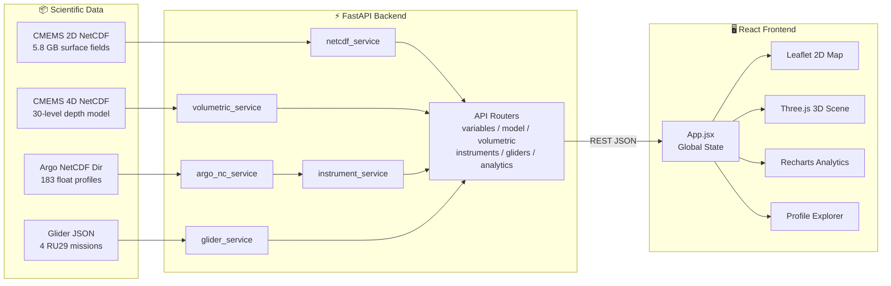

# 🌊 SAGAR-DRISHTI — सागर-दृष्टि

<div align="center">

[](https://www.sih.gov.in/)
[](https://www.sih.gov.in/)
[](https://incois.gov.in/)
[](#)

[](https://www.python.org/)
[](https://fastapi.tiangolo.com/)
[](https://react.dev/)
[](https://threejs.org/)
[](https://vitejs.dev/)
[](https://leafletjs.com/)
[](#)

**A browser-native, zero-install 3D ocean intelligence platform that unifies Copernicus Marine model forecasts with real Argo float and ocean glider observations in a single interactive workspace.**

*Built for the MoES / INCOIS use case: rapid ocean condition inspection, model-vs-observation validation, and science communication for technical and non-technical decision makers.*

</div>

---

## The Problem

India's INCOIS monitors **2.3 million km²** of Exclusive Economic Zone with a network of BGC-Argo floats, underwater gliders, and numerical ocean models. The gap is in tooling: forecasters must switch between desktop GIS software, licensed data viewers, and bespoke scripts to cross-check model outputs against real observations — costing 15+ critical minutes during cyclone advisories.

**SAGAR-DRISHTI** eliminates that gap. One browser tab. No installation. Real data. Full 2D/3D co-visualization.

---

## What It Does

```
┌─────────────────────────────────────────────────────────────────────────────────────────────┐
│                              SAGAR-DRISHTI DATA PIPELINE                                     │
├──────────────────────────┬───────────────────────────┬──────────────────────────────────────┤
│  🛰️  CMEMS Model          │  🤖  Argo Floats           │  🌊  Ocean Gliders                   │
│  5.8 GB NetCDF            │  183 NetCDF profiles       │  4 IOOS ERDDAP RU29 Missions         │
│  1,553 daily steps        │  91 active platforms       │  24,611 real CTD observations        │
│  6 surface variables      │  7 BGC sensor parameters   │  935 m max dive depth                │
│  ┌──────────────────┐     │  Jun 2025 – Aug 2026       │  Bay of Bengal + Arabian Sea         │
│  │ 4D Depth Model   │     └───────────────────────────┴──────────────────────────────────────┤
│  │ Aug 25–31 2026   │           ⬇  Copernicus Marine Service + IOOS ERDDAP                   │
│  │ 30 depth levels  │                                                                         │
│  │ 1.5 m → 454 m    │      ⚡  FastAPI Backend  (Python, xarray, netCDF4, SciPy)             │
│  │ thetao/so/uo/vo  │                ⬇  REST JSON  /api                                      │
│  └──────────────────┘                                                                         │
│                          React 18 + Three.js WebGL  +  Leaflet GIS  +  Recharts              │
└─────────────────────────────────────────────────────────────────────────────────────────────┘
```

The platform has four main views:

| View | What you can do |
|---|---|
| **2D GIS Map** | Inspect any CMEMS variable as a heatmap overlay on a Leaflet map. Click a point → instant 4-year time series. Toggle animated current vectors. |
| **3D WebGL Terrain** | Rotate the same ocean field as a Three.js height-field terrain. Enable depth-resolved Marching Cubes isosurface shells for thermocline visualization. |
| **Argo & Gliders** | Browse 91 Argo floats + 4 glider missions. Click any platform → depth profile charts (7 BGC parameters) + T-S water mass diagram + model co-location comparison. |
| **Analytics & Anomalies** | Compute spatial statistics, 20-bin histograms, 4-year trend lines, rolling means, anomaly fields, and Pearson cross-correlations at any grid point or bounding box. |

---

## Technology Stack

### Backend

| Package | Version | Role |
|---|---|---|
| **Python** | `3.10+` | Runtime |
| **FastAPI** | `0.115` | REST API framework, OpenAPI docs, async routing |
| **Uvicorn** | `0.30` | ASGI server |
| **xarray** | latest | NetCDF-4 dataset slicing and nearest-coordinate selection |
| **netCDF4** | `1.7.4` | Low-level HDF5/NetCDF read engine |
| **NumPy** | `2.3.5` | Numerical operations, gradient computation for `sivelo` |
| **SciPy** | `1.16.1` | Interpolation, OLS regression, Pearson correlation |
| **pandas** | `2.3.3` | Time series manipulation and date parsing |
| **Pydantic** | `2.13.5` | Response model validation and schema generation |

### Frontend

| Package | Version | Role |
|---|---|---|
| **React** | `18` | Component model, state management, tab navigation |
| **Vite** | `5` | Dev server, HMR, production bundle, `/api` proxy |
| **Three.js** | `0.160` | WebGL 3D terrain mesh, orbit controls, raycasting, isosurface |
| **Leaflet** | `1.9` | 2D GIS tile map, canvas raster overlays, marker layers |
| **react-leaflet** | `4` | React bindings for Leaflet |
| **Recharts** | `2.12` | Depth profiles, T-S diagrams, time-series, histograms, scatter |
| **lucide-react** | latest | Icon set |

### Data Formats

| Format | Where used |
|---|---|
| **NetCDF-4 / HDF5** | CMEMS ocean model fields (2D surface + 4D volumetric), Argo float profiles |
| **JSON** | Prepared glider mission data (`real_glider_tracks.json`), all API responses |

---

## Architecture



### How a request flows

1. `App.jsx` boots by calling `/api/health`, `/api/variables`, `/api/variables/dates`, `/api/volumetric/meta`, `/api/instruments`, `/api/gliders`, and `/api/instruments/trajectories/all` in parallel.
2. User selects a variable + date → frontend calls `/api/model/surface?variable=tob&date=2026-08-01&downsample=2`.
3. `netcdf_service` opens the CMEMS NetCDF with `xarray.open_dataset()`, selects the nearest time coordinate, downsamples the 2D field, masks NaN (land) cells, and returns `{lats, lons, values}`.
4. `OceanMap.jsx` paints the field into an HTML `<canvas>` element overlaid on the Leaflet tile map via `imageOverlay`.
5. `Scene3D.jsx` simultaneously rebuilds a Three.js `PlaneGeometry` with vertex Y-displacements from the same normalized values, applying the shared `colormap.js` palette to vertex colors.
6. Clicking a map point calls `/api/model/timeseries` → Recharts line chart renders the full 1,553-day series in the right panel.

---

## Repository Layout

```
sih26067-prototype/
│
├── backend/
│   ├── app/
│   │   ├── main.py                   # FastAPI app factory, CORS, lifespan, root/health endpoints
│   │   ├── config.py                 # All dataset paths, variable metadata, palettes, time caps
│   │   ├── schemas.py                # Pydantic response models for every endpoint
│   │   │
│   │   ├── routers/
│   │   │   ├── variables.py          # GET /api/variables, /api/variables/dates
│   │   │   ├── model.py              # GET /api/model/surface|timeseries|stats|anomaly
│   │   │   ├── volumetric.py         # GET /api/volumetric/meta|depth-slice|currents|profile|isosurface
│   │   │   ├── instruments.py        # GET /api/instruments + /{id}/profile|trajectory|tsdiagram
│   │   │   ├── gliders.py            # GET /api/gliders + /{id}/profile
│   │   │   └── analytics.py          # GET /api/analytics/trend|correlation|region_stats
│   │   │
│   │   └── services/
│   │       ├── netcdf_service.py     # xarray-backed 2D CMEMS reader; derives sivelo from SSH gradients
│   │       ├── volumetric_service.py # 4D depth-level reader, current vector assembly, isosurface grids
│   │       ├── argo_nc_service.py    # Parses Coriolis GDAC NetCDF profiles; handles BGC + physical params
│   │       ├── instrument_service.py # Builds float catalogue; runs spatial-temporal model co-location
│   │       └── glider_service.py     # Reads prepared RU29 mission JSON
│   │
│   ├── data/                         # Scientific assets (excluded from git — see .gitignore)
│   │   ├── cmems_Copernicus_Marine_Ocean_Dataset.nc
│   │   ├── real_ocean_model_4d.nc
│   │   ├── DataSelection_20260831_164219_15508736/  # 183 Argo NetCDF files
│   │   ├── real_glider_tracks.json
│   │   ├── build_real_gliders.py     # Rebuilds glider JSON from IOOS ERDDAP
│   │   ├── merge_aug2026_4d.py       # Merges Copernicus 4D download chunks
│   │   └── analyze_argo.py           # Argo NetCDF inspection utility
│   │
│   └── requirements.txt
│
├── frontend/
│   ├── src/
│   │   ├── App.jsx                   # Bootstrap, global state (variable/date/depth/palette/mode), tab router
│   │   ├── api.js                    # Typed fetch wrappers for all backend endpoints
│   │   ├── styles.css                # Glassmorphism dark theme, layout grid, animation utilities
│   │   │
│   │   ├── components/
│   │   │   ├── OceanMap.jsx          # Leaflet map + canvas raster painter + current arrow renderer
│   │   │   ├── Scene3D.jsx           # Three.js scene lifecycle, terrain mesh, orbit controls, raycasting
│   │   │   ├── ControlPanel.jsx      # Dataset mode, variable picker, date/depth sliders, playback, style controls
│   │   │   ├── ProfileChart.jsx      # Recharts depth profile, T-S diagram, dual observed/model overlay
│   │   │   ├── StatsDashboard.jsx    # Preset locations, stats/trend/correlation panels, written interpretation
│   │   │   ├── InstrumentSummaryPanel.jsx  # Platform card: coords, depth, MLD, thermocline, MAE/RMSE
│   │   │   ├── ColorbarEditor.jsx    # Palette switcher, value range slider, linear/log toggle
│   │   │   └── VariableExplanationCard.jsx # Contextual science cards per active variable
│   │   │
│   │   └── utils/
│   │       ├── colormap.js           # Single source of truth for palette → RGB; used in 2D canvas + 3D vertex colors
│   │       ├── marchingCubes.js      # Client-side isosurface extraction from 3D scalar grid
│   │       └── indiaCoastlines.js    # High-precision vector coastline data (India, Sri Lanka, islands)
│   │
│   ├── index.html
│   ├── package.json
│   └── vite.config.js                # Dev server + /api → http://127.0.0.1:8000 proxy
│
├── capture_all_views.py              # Playwright automation: screenshots of all UI tabs
├── PROJECT.md                        # Extended technical design notes
└── README.md
```

---

## Datasets

All scientific assets live under `backend/data/` and are excluded from git (large binaries).

| Dataset | Source | Coverage | File |
|---|---|---|---|
| **CMEMS 2D Surface** | Copernicus Marine Service | `2022-06-01` → `2026-08-31` · 1,553 days · 6 vars · 9 km grid | `cmems_Copernicus_Marine_Ocean_Dataset.nc` |
| **CMEMS 4D Depth** | CMEMS ANFC Physics Model | `2026-08-25` → `2026-08-31` · 7 days · 30 depth levels · 1.5–454 m | `real_ocean_model_4d.nc` |
| **Argo Floats** | Coriolis GDAC / Argo Program | `2025-06-01` → `2026-08-31` · 91 floats · 183 NC files · 7 BGC params | `DataSelection_*/` directory |
| **Ocean Gliders** | IOOS Glider DAC (RU29 Slocum G2) | `2026-08-17` → `2026-08-31` · 4 missions · 24,611 CTD obs | `real_glider_tracks.json` |

**Domain:** Arabian Sea + Bay of Bengal — `5–22°N, 68–95°E` at `0.083°` (~9 km) resolution.

### CMEMS Variable Catalogue

| Variable | Full Name | Units | Palette | Range (typical) |
|---|---|---|---|---|
| `tob` | Sea Bottom Temperature | °C | `thermal` (blue → red) | 2–32 °C |
| `sob` | Sea Bottom Salinity | PSU | `haline` (purple → yellow) | 30–37 PSU |
| `zos` | Sea Surface Height | m | `viridis` | −0.5 – +0.9 m |
| `mlotst` | Mixed Layer Depth | m | `deep` | 5–200 m |
| `pbo` | Sea Floor Pressure | dbar | `deep` | 0–6,500 dbar |
| `sivelo` | Surface Drift Velocity *(derived)* | m/s | `speed` (navy → cyan → red) | 0.01–1.68 m/s |

`sivelo` is **not a raw model variable** — it is derived from sea surface height gradients using geostrophic balance (see [Scientific Methods](#scientific-methods)).

### 4D Volumetric Variables

| API Name | NetCDF Variable | Meaning |
|---|---|---|
| `temperature` | `thetao` | Potential temperature |
| `salinity` | `so` | Practical salinity |
| `u_current` | `uo` | Eastward seawater velocity |
| `v_current` | `vo` | Northward seawater velocity |

---

## Scientific Methods

### Nearest-Neighbor Spatial-Temporal Co-Location

To compare an Argo/Glider observation at position $(\phi_p, \lambda_p, t_p)$ against the model, the backend finds:

$$(\phi^*, \lambda^*, t^*) = \arg\min_{\phi_i,\lambda_j,t_k} \bigl(|\phi_i-\phi_p| + |\lambda_j-\lambda_p|\bigr), \quad |t_k - t_p| \text{ minimized independently}$$

The co-located model profile is interpolated onto observed depth levels $z$ and validation metrics are computed over all paired valid values $N$:

$$\text{MAE} = \frac{1}{N}\sum_{i=1}^N |y_i - \hat{y}_i|, \qquad \text{RMSE} = \sqrt{\frac{1}{N}\sum_{i=1}^N (y_i - \hat{y}_i)^2}$$

### Geostrophic Surface Drift Velocity (`sivelo`)

Derived from the sea surface height field $\eta$ using finite differences on the model grid:

$$u_g = -\frac{g}{f}\frac{\partial\eta}{\partial y}, \qquad v_g = \frac{g}{f}\frac{\partial\eta}{\partial x}, \qquad \text{sivelo} = \sqrt{u_g^2 + v_g^2}$$

where $g = 9.81\text{ m s}^{-2}$ and $f = 2\Omega\sin\phi$ is the latitude-varying Coriolis parameter. This yields physically realistic current speeds of **0.01–1.68 m/s** from SSH alone.

### Spatial Anomaly

$$\Delta V_{i,j}(t) = V_{i,j}(t) - \frac{1}{N}\sum_{k=1}^{N} V_{i,j}(t_k)$$

Pixel-wise deviation from the multi-year mean — critical for identifying marine heatwave anomalies and cyclone heat potential.

### Shared Color Semantics

`utils/colormap.js` is the **single color authority**. `colorForValue(val, min, max, palette)` is called by:
- `OceanMap.jsx` canvas raster painter (2D heatmap pixels)
- `Scene3D.jsx` terrain vertex color buffer (3D mesh)
- `Scene3D.jsx` current cone material (3D vectors)
- `ColorbarEditor.jsx` legend gradient

This guarantees a value of `28.5°C` looks identical on the 2D map and in the 3D scene.

---

## Local Setup

### Prerequisites

- Python `3.11+` (Python 3.14 is supported)
- Node.js `18+` and npm
- A WebGL 2.0 capable browser (Chrome, Edge, Firefox)
- 4 GB+ free RAM for NetCDF in-memory caching
- Scientific data files placed under `backend/data/` (see [Datasets](#datasets))

---

### 1 — Clone

```bash
git clone https://github.com/RutuRaj-1/Sagar_Drishti.git
cd Sagar_Drishti
```

---

### 2 — Backend

```bash
cd backend

# Create virtual environment
python -m venv .venv

# Activate (Windows PowerShell)
.\.venv\Scripts\Activate.ps1
# Activate (Linux / macOS)
# source .venv/bin/activate

# Install dependencies
pip install --upgrade pip
pip install -r requirements.txt

# Start the API server (with hot reload)
python -m uvicorn app.main:app --host 127.0.0.1 --port 8000 --reload
```

Verify the backend is healthy:
- **Swagger docs:** http://127.0.0.1:8000/docs
- **Health check:** http://127.0.0.1:8000/api/health → should show `"time_range": "2022-06-01 to 2026-08-31"`

---

### 3 — Frontend

Open a second terminal:

```bash
cd frontend
npm install
npm run dev
```

Open **http://localhost:5173**. Vite proxies all `/api/*` requests to `http://127.0.0.1:8000` via `vite.config.js` — no CORS configuration needed in development.

---

### 4 — Optional: Rebuild Glider Data

```bash
# Re-fetches RU29 mission data from IOOS ERDDAP and writes real_glider_tracks.json
python backend/data/build_real_gliders.py
```

### 5 — Optional: Download Fresh 4D Depth Data

```bash
# Requires: pip install copernicusmarine && copernicusmarine login
copernicusmarine subset -i cmems_mod_glo_phy-thetao_anfc_0.083deg_P1D-m \
  -v thetao -t 2026-08-25 -T 2026-08-31 \
  -x 68.0 -X 95.0 -y 5.0 -Y 22.0 -z 1.5 -Z 500 \
  -o backend/data -f real_ocean_model_4d.nc --overwrite
```

---

## REST API Reference

Interactive documentation with request/response schemas is available at **http://127.0.0.1:8000/docs** once the backend is running.

### Core Endpoints

| Method | Path | Description | Key Parameters |
|:---:|---|---|---|
| `GET` | `/api/health` | Service status, version, domain, dataset date range | — |
| `GET` | `/api/variables` | CMEMS variable catalogue (name, units, palette, color) | — |
| `GET` | `/api/variables/dates` | Array of all 1,553 available daily date strings | — |

### 2D Model (CMEMS Surface)

| Method | Path | Description | Parameters |
|:---:|---|---|---|
| `GET` | `/api/model/surface` | 2D horizontal field as `{lats, lons, values}` | `variable`, `date`, `downsample` |
| `GET` | `/api/model/timeseries` | Daily series at nearest grid point | `variable`, `lat`, `lon` |
| `GET` | `/api/model/stats` | Domain statistics + 20-bin histogram | `variable`, `date` |
| `GET` | `/api/model/anomaly` | Field minus long-term pixel-wise mean | `variable`, `date`, `downsample` |

### 4D Volumetric (Depth-Resolved)

| Method | Path | Description | Parameters |
|:---:|---|---|---|
| `GET` | `/api/volumetric/meta` | Variable list, depth levels, date range | — |
| `GET` | `/api/volumetric/depth-slice` | 2D horizontal slice at given depth + date | `variable`, `date`, `depth`, `downsample` |
| `GET` | `/api/volumetric/currents` | `uo/vo` vector field with speed + angle | `date`, `depth`, `downsample` |
| `GET` | `/api/volumetric/profile` | Full vertical model profile at location | `lat`, `lon`, `date`, `variable` |
| `GET` | `/api/volumetric/isosurface` | 3D scalar grid for client-side Marching Cubes | `variable`, `date`, `max_depth` |

### Argo Floats & Gliders

| Method | Path | Description |
|:---:|---|---|
| `GET` | `/api/instruments` | Platform list (91 floats) with coordinates, basin, last date |
| `GET` | `/api/instruments/{id}/profile` | Observed depth profile; pass `compare_variable` for co-location |
| `GET` | `/api/instruments/{id}/trajectory` | GPS surfacing track history |
| `GET` | `/api/instruments/{id}/tsdiagram` | Paired temperature-salinity scatter points |
| `GET` | `/api/instruments/trajectories/all` | All float tracks in one response |
| `GET` | `/api/gliders` | Glider mission directory (4 missions) |
| `GET` | `/api/gliders/{id}/profile` | Glider CTD depth profile |

### Analytics

| Method | Path | Description | Parameters |
|:---:|---|---|---|
| `GET` | `/api/analytics/trend` | Time series, rolling mean, OLS regression slope | `variable`, `lat`, `lon`, `window` |
| `GET` | `/api/analytics/correlation` | Pearson `r`, `R²`, scatter data (≤200 pts) | `var1`, `var2`, `lat`, `lon` |
| `GET` | `/api/analytics/region_stats` | Statistics over a bounding box | `variable`, `date`, bbox params |

**Example request:**
```
GET http://127.0.0.1:8000/api/model/surface?variable=tob&date=2026-08-01&downsample=2
```

---

## Troubleshooting

```powershell
# Quick backend health check
Invoke-RestMethod http://127.0.0.1:8000/api/health

# Validate frontend builds cleanly
cd frontend && npm run build
```

| Symptom | Fix |
|---|---|
| `API Offline` badge in top bar | Uvicorn is not running or crashed. Check terminal on port `8000`. |
| `404` on any `/api/*` route | Vite proxy target must be `http://127.0.0.1:8000` in `vite.config.js`. |
| Blank / all-transparent heatmap | Data file missing under `backend/data/`. Masked (land) cells are transparent by design. |
| Blank 3D viewport | Enable hardware acceleration in browser settings. Requires WebGL 2.0. |
| Very slow first request | xarray reads the full NetCDF into cache on first call. Subsequent requests are fast. |
| `KeyError: variable` in backend | Check variable name is one of `tob / sob / zos / mlotst / pbo / sivelo`. |

---

## Who Is This For

| Persona | Organization | Time Saved |
|---|---|---|
| **Duty Forecaster** | INCOIS 24/7 Watch | Model-vs-float validation drops from **15+ min → 30 sec** |
| **Oceanographic Researcher** | MoES, NIO, IITs | 4D water column (1.5–454 m), T-S diagrams, BGC profiles in one tab |
| **Data / IT Admin** | INCOIS IT | Add a new NetCDF variable in `config.py` — zero frontend code changes |
| **Disaster Management Officer** | NDRF / State SDMAs | Zero-install browser access during active cyclone operations |
| **Student / Educator** | Universities | Interactive 3D Indian Ocean globe on any classroom laptop |

---

## What's Done vs What's Next

### Completed (Current Build)

- [x] Modular NetCDF ingestion — zero-code onboarding of CF-compliant files
- [x] BGC-Argo 7-parameter support (TEMP, PSAL, DOXY, CHLA, NITRATE, pH, BBP700)
- [x] Automated spatial-temporal model co-location with MAE/RMSE metrics
- [x] 4 real IOOS Slocum RU29 glider missions with 24,611 CTD observations
- [x] 4D volumetric analysis — 30 real depth levels to 454 m (CMEMS ANFC)
- [x] Geostrophic `sivelo` derived from SSH gradients
- [x] 100% real scientific data — no synthetic generators anywhere
- [x] Client-side Marching Cubes isosurface (WebGL, no server render)
- [x] Palette-synchronized 2D/3D — same colormap function for map pixels and 3D vertex colors

### Planned for Production

- [ ] **OGC WMS/WCS** — standardized raster export for national GIS interoperability
- [ ] **HF-Radar + RAMA Buoy** — coastal observation ingestion adapters
- [ ] **Role-Based Access Control** — Forecaster / Researcher / Public tiers
- [ ] **Zarr + S3** — replace local NetCDF with chunked cloud object storage
- [ ] **Live GDAC Feed** — real-time float profile ingestion via Airflow workers
- [ ] **OAuth2 / Audit Logging** — enterprise security before INCOIS deployment

---

## Limitations

This is a **local hackathon prototype**, not a production service:

- Heavy NetCDF files are local dependencies — not object storage
- CORS is set to permissive (`*`) for development — must be restricted before deployment
- Volumetric responses are full JSON arrays — expensive for large domains; needs tile streaming
- Co-location uses nearest-neighbor — no 4D trilinear interpolation yet
- No authentication, audit trail, or persistent storage
- No automated test suite or CI pipeline

---

## Acknowledgments

- **Hackathon**: Smart India Hackathon 2026 — Software Edition, Problem Statement `26067`
- **Sponsoring Ministry**: Ministry of Earth Sciences (MoES), Government of India
- **Problem Owner**: Indian National Centre for Ocean Information Services (INCOIS), Hyderabad
- **Data Sources**:
  - [Copernicus Marine Service](https://marine.copernicus.eu/) — CMEMS ANFC Ocean Physics Model
  - [Coriolis GDAC](https://www.coriolis.eu.org/) / International Argo Program — BGC-Argo profiles
  - [IOOS Glider DAC](https://gliders.ioos.us/) / Rutgers University COOL Lab — RU29 Slocum G2 missions
- **Repository**: https://github.com/RutuRaj-1/Sagar_Drishti

---

<div align="center">
<sub>Built with ⚡ FastAPI · React · Three.js · Leaflet · xarray · for Smart India Hackathon 2026</sub>
</div>